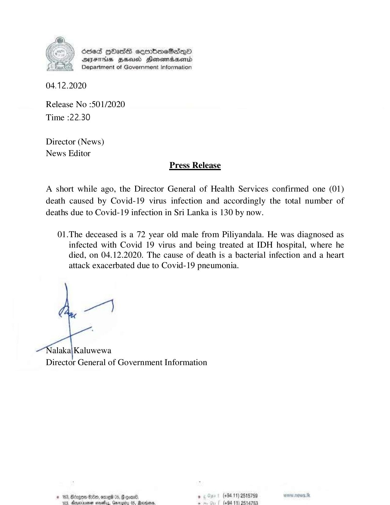

# Press Release - 2020.12.04 - Covid 19 infection death has been reported 
Key: 2c4e9e2cf24cc62325a820c4f4be2b23 

---
```
Osed Hbasts sembneSasqQo
DFTs HHousd Hensondbasend
Department of Government Information

 

04.12.2020

Release No :501/2020
Time :22.30

Director (News)
News Editor

Press Release

A short while ago, the Director General of Health Services confirmed one (01)
death caused by Covid-19 virus infection and accordingly the total number of
deaths due to Covid-19 infection in Sri Lanka is 130 by now.

01.The deceased is a 72 year old male from Piliyandala. He was diagnosed as
infected with Covid 19 virus and being treated at IDH hospital, where he
died, on 04.12.2020. The cause of death is a bacterial infection and a heart
attack exacerbated due to Covid-19 pneumonia.

ye)

alaka| Kaluwewa
Director General of Government Information

. (+94 11) 2515759 anew. news. tk

© 163, cagon Ge, omel ,
2 (694-11) 2514783

    

```
