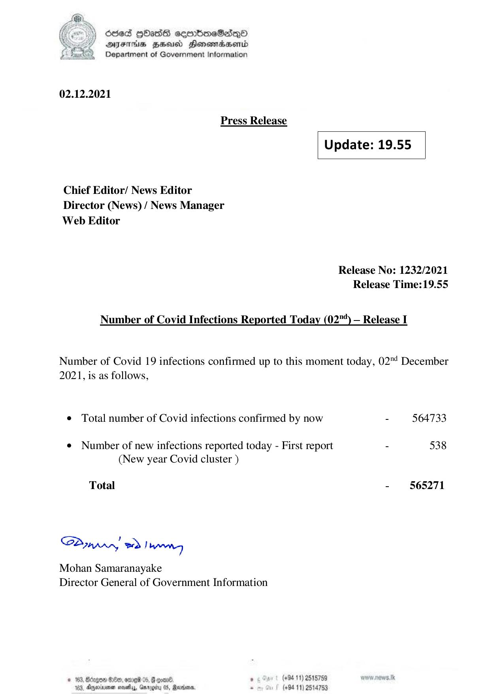

# Press Release - 2021.12.02 
Key: 2c951fc7938db7ae22485c2e5d5ed5db 

---
```
) dcded QhasS ceerbneSdiqQo
DFTs HH Honsomadsenid
Department of Government Information

 

 

02.12.2021
Press Release
Update: 19.55
Chief Editor/ News Editor
Director (News) / News Manager
Web Editor

Release No: 1232/2021
Release Time:19.55

Number of Covid Infections Reported Today (02"“) — Release I

Number of Covid 19 infections confirmed up to this moment today, 02"! December
2021, is as follows,

© Total number of Covid infections confirmed by now - 564733

¢ Number of new infections reported today - First report - 538
(New year Covid cluster )

Total - 565271

Sa mprr wd! bong

Mohan Samaranayake
Director General of Government Information

 

© 163, Bdzgoe $10, ome 05, @ gomn® , (+94 11) 2518759
163. Agywinmen sess, Gnroerty 05, arbors. . (+94 11) 2514753

```
