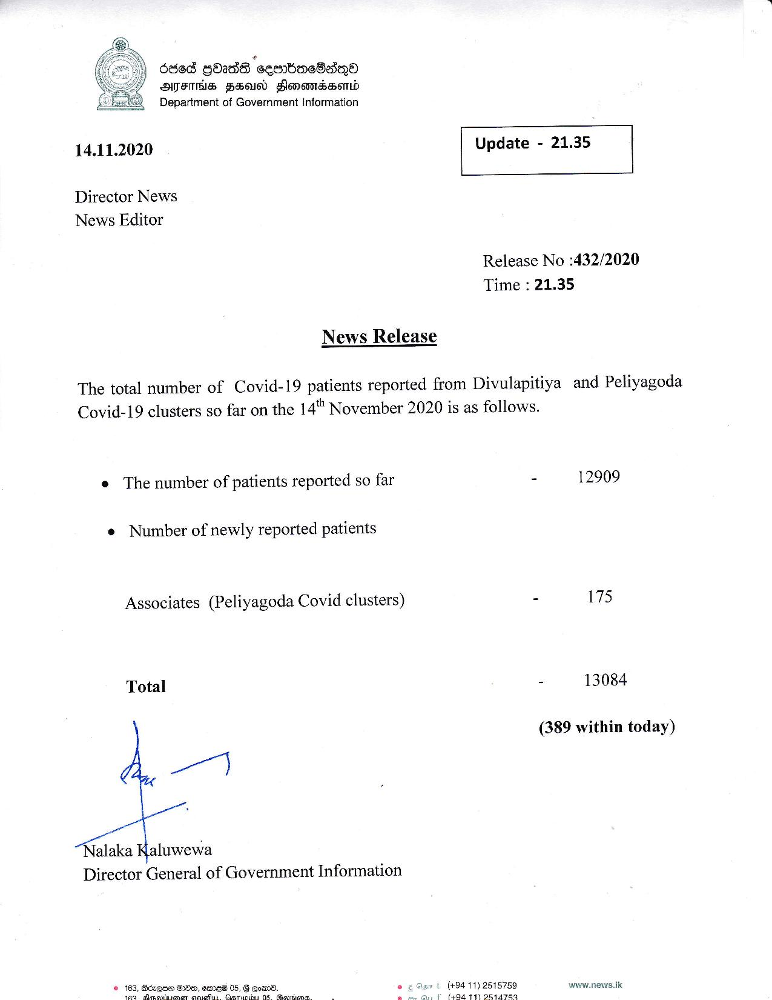

# Press Release - 2020.11.14 
Key: 2ceb45e8d03c86ef699faa015bc815f1 

---
```
 
 
 

| 6668 gad seaWacSaqQo
AAS FSU Honswmssomd
Department of Government Information

 

14.11.2020 Update - 21.35

 

 

 

Director News
News Editor

Release No :432/2020
Time : 21.35

News Release

The total number of Covid-19 patients reported from Divulapitiya and Peliyagoda
Covid-19 clusters so far on the 14" November 2020 is as follows.

e The number of patients reported so far

e Number of newly reported patients

Associates (Peliyagoda Covid clusters)

Total

wl

“Klalaka aluwewa
Director General of Government Information

© 163, Bézqne B00, amew 05, 8 oom0. .
slat ca a a a Te it aaa

i (494 11) 2515759
(494 11) OR14769

 

 

- 12909

- 175

- 13084

(389 within today)

www.news.ik

```
