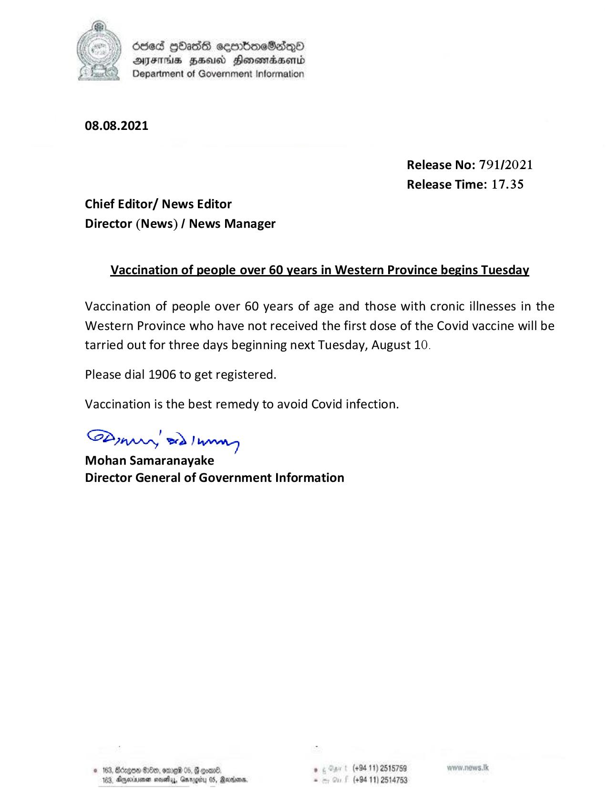

# Press Release  - 2021.08.08 - Vaccination of People over 60 years in Western Province begins Tuesday 
Key: 2d200e2cb9986a4ce69b42a3c00f8d95 

---
```
deed GOass semmbioeSadqQo
AIFS HEU Honomadsend
Department of Government Information

 

08.08.2021

Release No: 791/2021
Release Time: 17.35
Chief Editor/ News Editor
Director (News) / News Manager

Vaccination of people over 60 years in Western Province begins Tuesday

Vaccination of people over 60 years of age and those with cronic illnesses in the
Western Province who have not received the first dose of the Covid vaccine will be
tarried out for three days beginning next Tuesday, August 10.

Please dial 1906 to get registered.
Vaccination is the best remedy to avoid Covid infection.
SPumpry wd Janna

Mohan Samaranayake
Director General of Government Information

© 163, Bécges &0eo, ore 05, @ con®. . (+94 11) 2515759
163, Agexuee neaty, Grrggiy 05, Rares. . (+94 11) 2514753

 

```
