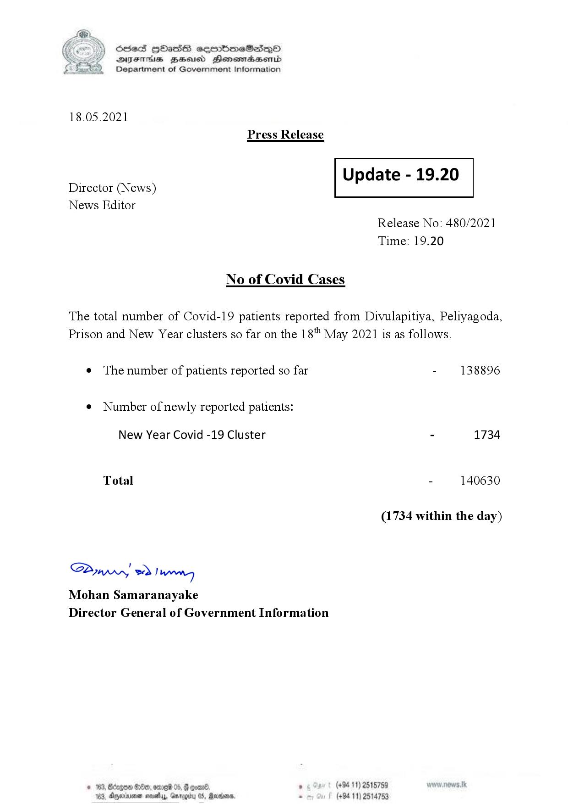

# Press Release - 2021.05.18 
Key: 2dcd952b8118ec7d8f69f25b4f03635c 

---
```
S) ScseS HOasdS cerrbmeSdQo
SVsThis geod Henssnadasombd
Department of Government Information

 

18.05.2021
Press Release

 

Update - 19.20

 

 

Director (News)
News Editor

 

Release No: 480/2021
Time: 19.20

No of Covid Cases

The total number of Covid-19 patients reported from Divulapitiya, Peliyagoda,
Prison and New Year clusters so far on the 18" May 2021 is as follows.

e The number of patients reported so far - 138896

¢ Number of newly reported patients:

New Year Covid -19 Cluster - 1734
Total - 140630
(1734 within the day)

Saw o> Danny
Mohan Samaranayake
Director General of Government Information

3, GHx, one 05, | com . (+94 11) 2515789
184, Aparna nae, Gmrogity 05, Rertoons, - (+94 11) 2514753

   

```
