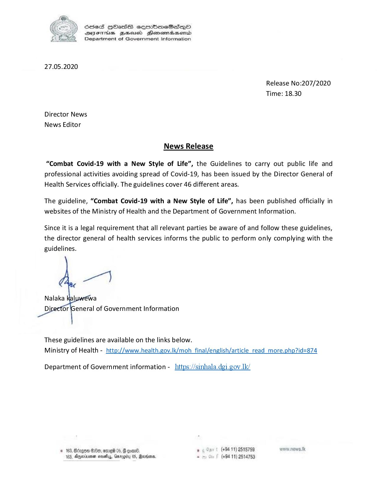

# Press Release - 2020.05.27 - Combat Covid 19 with a new style of life 
Key: 2e3f974afcf7a1397402fa94bb1fb767 

---
```
S803 HOASS eqrrbmeSsQo
DVsETis ZaHsucd Henemadasembd
Department of Government Information

    

27.05.2020

Release No:207/2020
Time: 18.30

Director News
News Editor

News Release

“Combat Covid-19 with a New Style of Life”, the Guidelines to carry out public life and
professional activities avoiding spread of Covid-19, has been issued by the Director General of
Health Services officially. The guidelines cover 46 different areas.

The guideline, “Combat Covid-19 with a New Style of Life”, has been published officially in
websites of the Ministry of Health and the Department of Government Information.

Since it is a legal requirement that all relevant parties be aware of and follow these guidelines,
the director general of health services informs the public to perform only complying with the

guidelines.

 

These guidelines are available on the links below.
Ministry of Health - http://www.health.gov.lk/moh final/english/article_read_more.php?id=874

Department of Government information - _https://sinhala.dgi.gov.lk/

© 163, Bdogom HO, mre 05, F comn6. . (+94 11) 2515789 wow. news. tk
183, Dpexasmen sas, Gmrogiby 05, Merron, - (+94 11) 2514753

 

```
