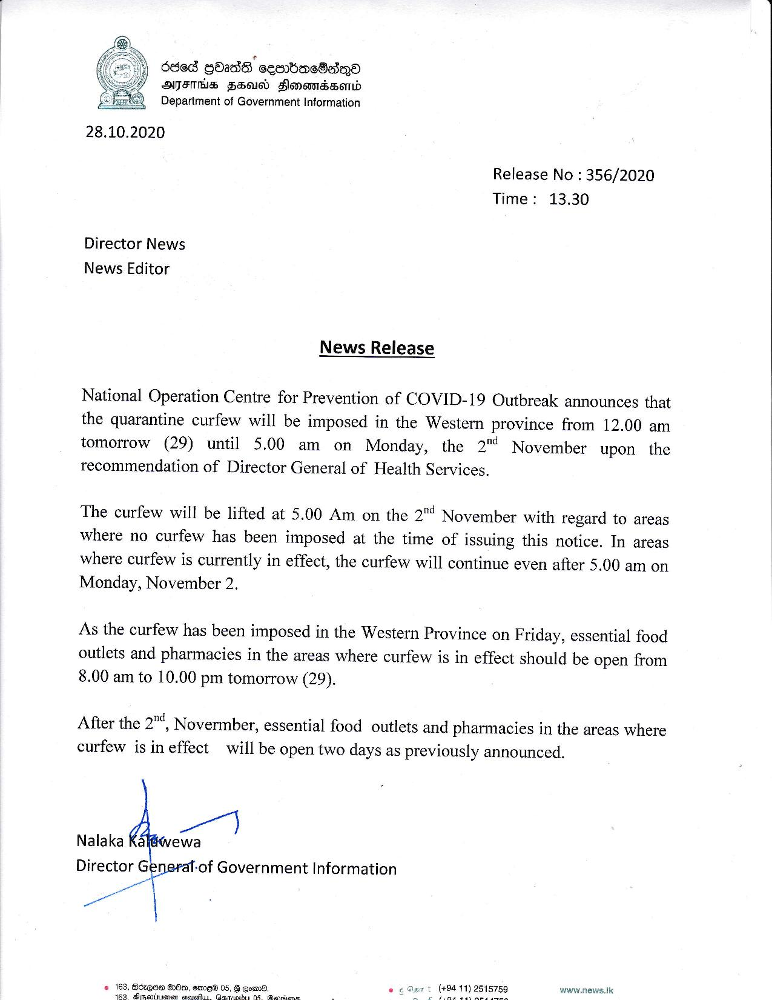

# Press Release - 2020.10.28 - Quarantine curfew will be imposed in The  Western Province from12 a.m tomorrow until 5.a.m on Monday the 2nd November 
Key: 2e4d79705c1dcb23b0ea562fbca666ea 

---
```
6868 GOsdG ceenbeacGadqQea
ATITHS FH) FonsmBsend
Department of Government Information

 

28.10.2020

Release No : 356/2020
Time: 13.30

Director News
News Editor

News Release

National Operation Centre for Prevention of COVID-19 Outbreak announces that
the quarantine curfew will be imposed in the Western province from 12.00 am
tomorrow (29) until 5.00 am on Monday, the 2" November upon the
recommendation of Director General of Health Services.

The curfew will be lifted at 5.00 Am on the 2"! November with regard to areas
where no curfew has been imposed at the time of issuing this notice. In areas
where curfew is currently in effect, the curfew will continue even after 5.00 am on
Monday, November 2.

As the curfew has been imposed in the Western Province on Friday, essential food
outlets and pharmacies in the areas where curfew is in effect should be open from
8.00 am to 10.00 pm tomorrow (29).

After the 2"4) Novermber, essential food outlets and pharmacies in the areas where
curfew is in effect will be open two days as previously announced.

ae)

Nalaka Kal@wewa

Director G -of Government Information
at

ae

© 163, Boxes Heo, emr_ew 05, B qowmd. wow.news.tk

163 dimevtnienen seat. Qerioins 0% Revcenc

 

 

```
