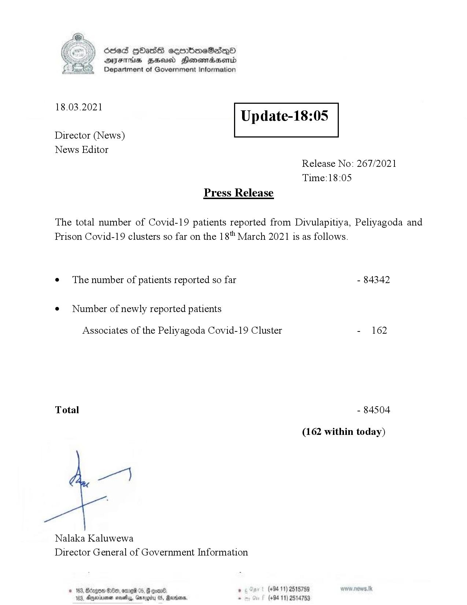

# Press Release - 2021.03.18 
Key: 2f6de9369a40a51cd9add48d9626853a 

---
```
Ssed HbasG sembmeSadqo
DAIS BHU Honomasentd
Department of Government Information

 

 

18.03.2021

Update-18:05

 

 

 

Director (News)
News Editor
Release No: 267/2021
Time:18:05
Press Release

The total number of Covid-19 patients reported from Divulapitiya, Peliyagoda and
Prison Covid-19 clusters so far on the 18" March 2021 is as follows.
e¢ The number of patients reported so far - 84342

¢ Number of newly reported patients

Associates of the Peliyagoda Covid-19 Cluster - 162

Total - 84504

(162 within today)

Nalaka Kaluwewa
Director General of Government Information

° (+94 11) 2515759
(+94 11) 2514753

© 163, Bdegon G0e, ome 05, G com
188, Agjerinenen mosetay, Garp

  

```
