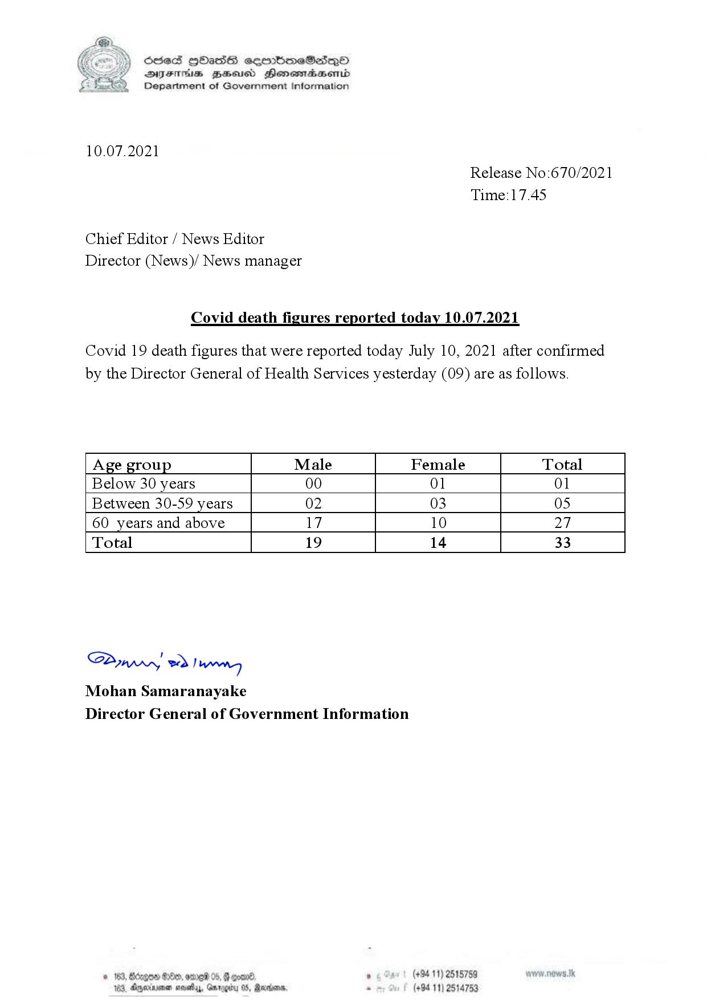

# Press Release - 2021.07.10 - Covid 19 infection deaths 
Key: 306de535c26df8282fedf7c7342eb78a 

---
```
(6 ) dcsed HbHass cermbm~eSadeQo
S DIsFHsS BHsusd Henewmiaaentd
Department of Government Information

 

10.07.2021
Release No:670/2021

Time:17.45

Chief Editor / News Editor
Director (News)/ News manager

Covid death figures reported today 10.07.2021

Covid 19 death figures that were reported today July 10, 2021 after confirmed
by the Director General of Health Services yesterday (09) are as follows.

 

 

 

 

 

Age group Male Female Total
Below 30 years 00 01 01
Between 30-59 years 02 03 05
60 years and above 17 10 27
Total 19 14 33

 

 

 

 

 

 

SP od Ianwng
Mohan Samaranayake
Director General of Government Information

NED 0 06) . (+94 11) 2515759
44, Gargtty 05, Martone, . (+94 11) 2514753

   

3, Agerniean s

```
