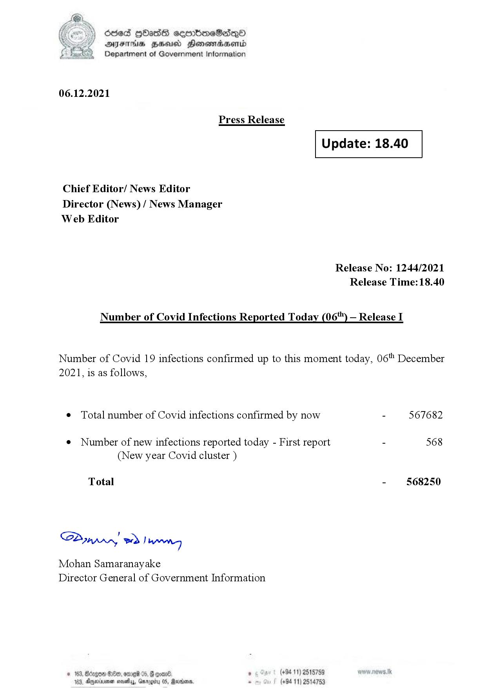

# Press Release - 2021.12.06 
Key: 30761b66a9b79ca7f12cae820f35b066 

---
```
(oe) Sed QOass cerrbroeSadqQo
DFS HHS Honsmnadaerntd
Department of Government Information

 

06.12.2021

Press Release

 

Update: 18.40

 

 

 

Chief Editor/ News Editor
Director (News) / News Manager
Web Editor

Release No: 1244/2021
Release Time:18.40

Number of Covid Infections Reported Today (06'") — Release I

Number of Covid 19 infections confirmed up to this moment today, 06" December

2021, is as follows,

¢ Total number of Covid infections confirmed by now - 567682

¢ Number of new infections reported today - First report - 568
(New year Covid cluster )

-  §68250

Total

Sa mprn! wd! wong

Mohan Samaranayake
Director General of Government Information

 
 

© 163, Bago G00, ore 05, # one , (+94 11) 2515789
183, Dryerinemen sovethys, Ga . (+94 11) 25

  

05, Rearions,

```
