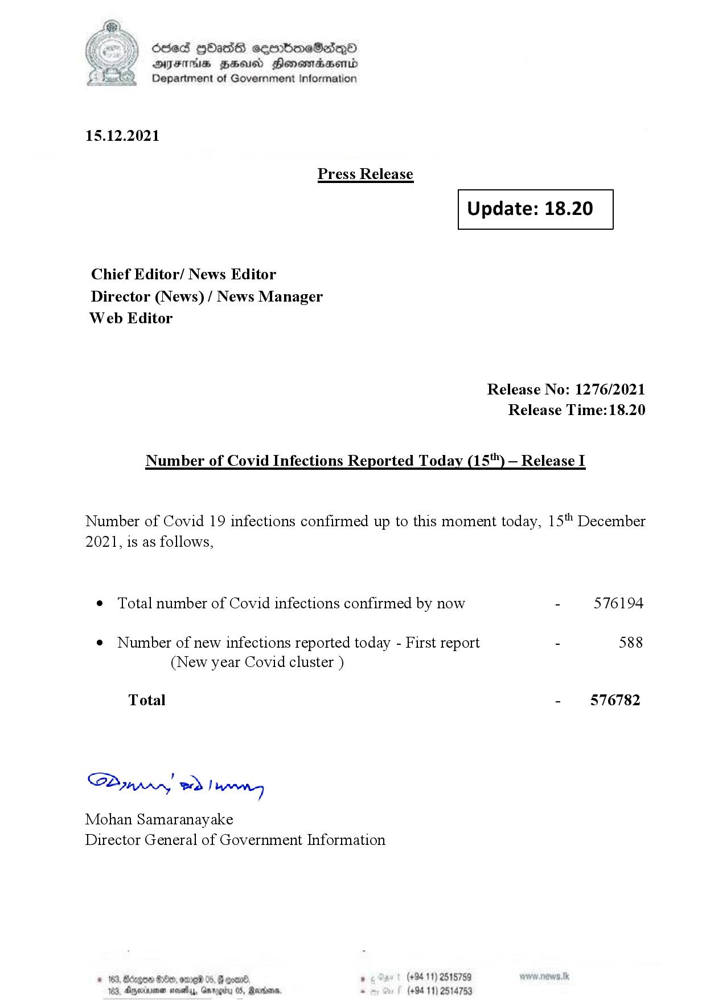

# Press Release - 2021.12.15 
Key: 315a1d79ce19a0e53d84f78252121202 

---
```
(oe) Sed QOass cerrbroeSadqQo
DFS HHS Honsmnadaerntd
Department of Government Information

 

15.12.2021

Press Release

 

Update: 18.20

 

 

 

Chief Editor/ News Editor
Director (News) / News Manager
Web Editor

Release No: 1276/2021
Release Time: 18.20

Number of Covid Infections Reported Today (15'") — Release I

Number of Covid 19 infections confirmed up to this moment today, 15" December
2021, is as follows,

¢ Total number of Covid infections confirmed by now - 576194

¢ Number of new infections reported today - First report - 588
(New year Covid cluster )

Total - 576782

Sa mprn! wd! wong

Mohan Samaranayake
Director General of Government Information

ant 5 (+94 11) 2515789
05, Rana. - (+84 11) 25

 
 

© 163, Bdrgon Ge, ome 05, F
163, Aparna sosehyy, Gnr

  

```
