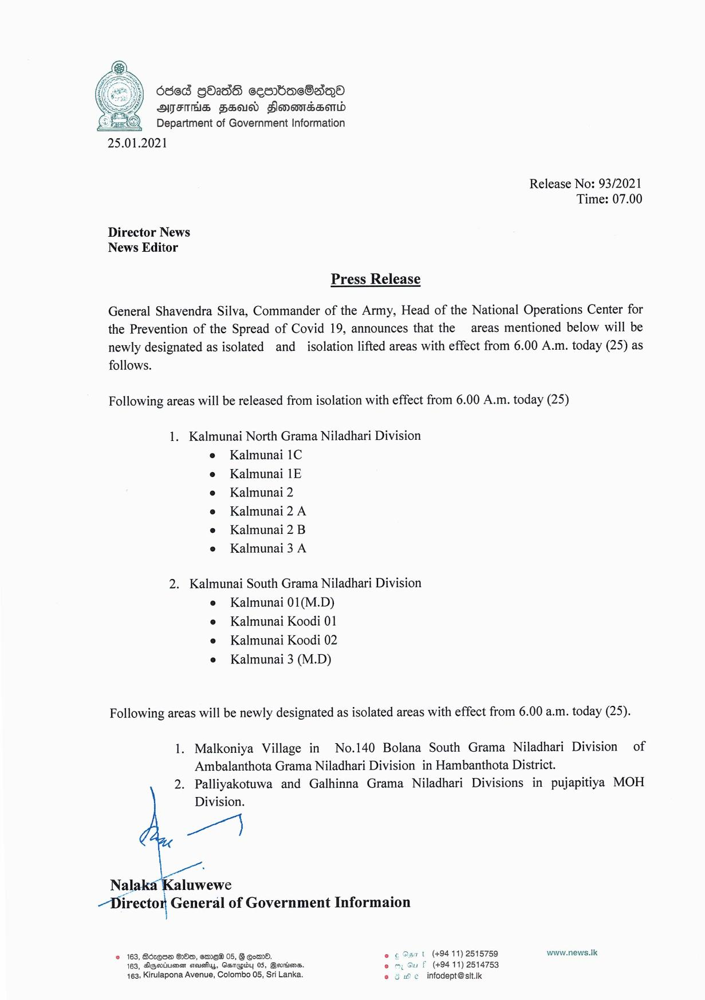

# Press Release - 2021.01.25 - Isolated lifting and newly isolated areas 
Key: 3172f6c79b599a4b0ad4a18d23df86d9 

---
```
 

25.01.2021

Director News
News Editor

636d Gb2dG cembacGaqo
OMFS FEA Honoweserd
Department of Government Information

Release No: 93/2021
Time: 07.00

Press Release

General Shavendra Silva, Commander of the Army, Head of the National Operations Center for
the Prevention of the Spread of Covid 19, announces that the areas mentioned below will be
newly designated as isolated and_ isolation lifted areas with effect from 6.00 A.m. today (25) as

follows.

Following areas will be released from isolation with effect from 6.00 A.m. today (25)

1. Kalmunai North Grama Niladhari Division

Kalmunai 1C
Kalmunai 1E
Kalmunai 2

Kalmunai 2 A
Kalmunai 2 B
Kalmunai 3 A

2. Kalmunai South Grama Niladhari Division

Kalmunai 01(M.D)
Kalmunai Koodi 01
Kalmunai Koodi 02
Kalmunai 3 (M.D)

Following areas will be newly designated as isolated areas with effect from 6.00 a.m. today (25).

1. Malkoniya Village in No.140 Bolana South Grama Niladhari Division of
Ambalanthota Grama Niladhari Division in Hambanthota District.

2. Palliyakotuwa and Galhinna Grama Niladhari Divisions in pujapitiya MOH
Division.

ar)

Nalal aluwewe
Director General of Government Informaion

© 163, Bérqne He, ere 05, G Cormd. © ¢ Saat (+9411) 2515759 www.news.Ik

169, Degeiuercr aavsius, Qarepisy 05, Berrios, .

  

P (494 11) 2514753

 

463, Kirulapona Avenue, Colombo 05, Sri Lanka. 2 5 © infodept@sit.ik

```
