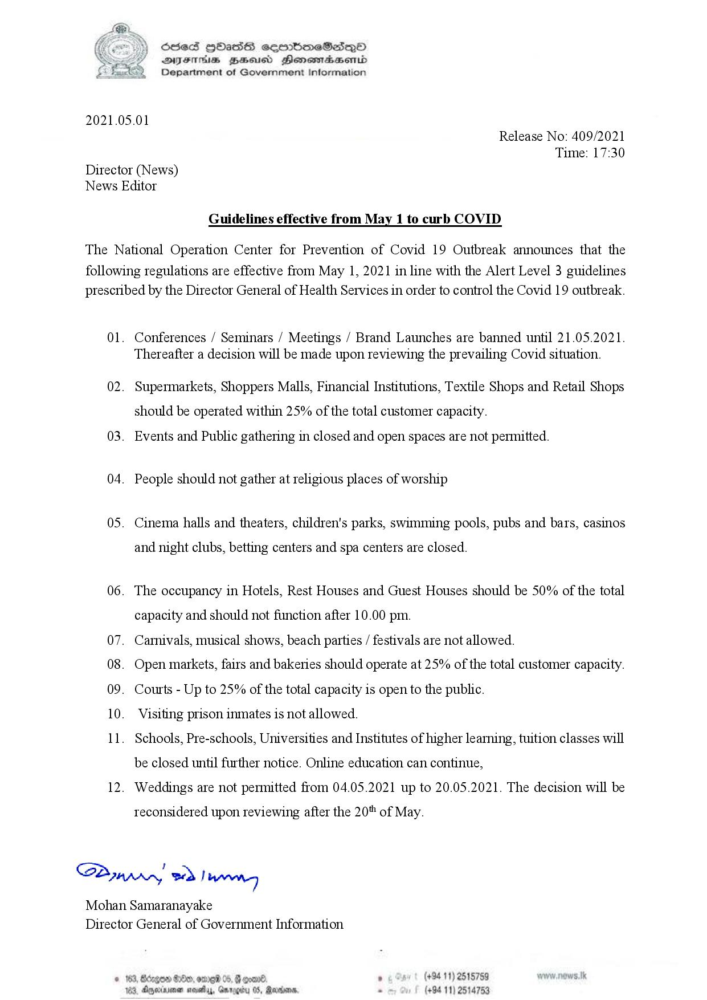

# Press Release - 2021.05.01 - Guidelines effective from May 01 to curb COVID 
Key: 31e4dd1858e5e95fdf7a4ac128baa5a5 

---
```
SB

 

Ses HOHasS sermmeSicsqeO
DIFTHS BHHousd Honewidasentd

©) Department of Government Information

2021.05.01

Release No: 409/2021
Time: 17:30

Director (News)
News Editor

Guidelines effective from May 1 to curb COVID

The National Operation Center for Prevention of Covid 19 Outbreak announces that the

following regulations are effective from May 1, 2021 in line with the Alert Level 3 guidelines
prescribed by the Director General of Health Services in order to control the Covid 19 outbreak.

01.

02.

03.

04.

05.

06.

07.
08.
09.
10.
ll.

12.

Conferences / Seminars / Meetings / Brand Launches are banned until 21.05.2021.
Thereafter a decision will be made upon reviewing the prevailing Covid situation.
Supermarkets, Shoppers Malls, Financial Institutions, Textile Shops and Retail Shops
should be operated within 25% of the total customer capacity.

Events and Public gathering in closed and open spaces are not permitted.
People should not gather at religious places of worship

Cinema halls and theaters, children's parks, swimming pools, pubs and bars, casinos

and night clubs, betting centers and spa centers are closed.

The occupancy in Hotels, Rest Houses and Guest Houses should be 50% of the total
capacity and should not function after 10.00 pm.

Carnivals, musical shows, beach parties / festivals are not allowed.

Open markets, fairs and bakeries should operate at 25% of the total customer capacity.
Courts - Up to 25% of the total capacity is open to the public.

Visiting prison inmates is not allowed.

Schools, Pre-schools, Universities and Institutes of higher learning, tuition classes will
be closed until further notice. Online education can continue,

Weddings are not permitted from 04.05.2021 up to 20.05.2021. The decision will be

reconsidered upon reviewing after the 20" of May.

Sd, eed Lie

Mohan Samaranayake
Director General of Government Information

 

3, Bdcgoe Se, ome 05,
53, dgeviniman novety, Gn

, (+9411) 2515759
(+84 11) 2514753

   

```
