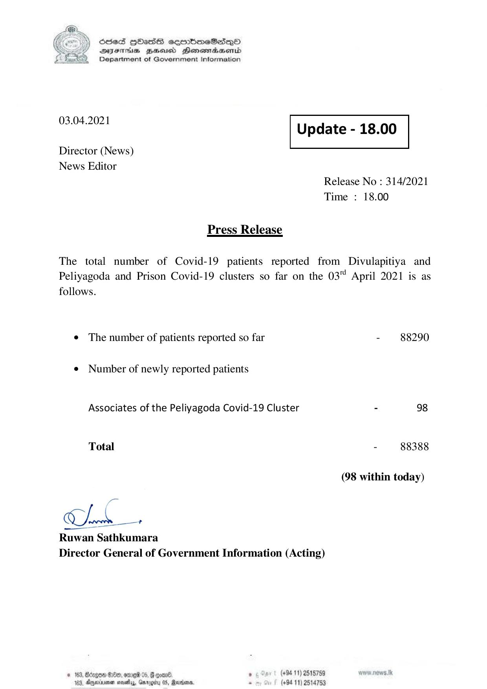

# Press Release - 2021.04.03 
Key: 31fa40c3e14846160df0720148ea4fa9 

---
```
) ScdeS HOadS cermbmeSsdQo
DVEFIHS HHosd Honomabsenid
Department of Government Information

 

 

03.04.2021

 

Update - 18.00

 

 

Director (News)
News Editor

Release No : 314/2021
Time : 18.00

Press Release

The total number of Covid-19 patients reported from Divulapitiya and
Peliyagoda and Prison Covid-19 clusters so far on the 03" April 2021 is as

follows.

¢ The number of patients reported so far

¢ Number of newly reported patients
Associates of the Peliyagoda Covid-19 Cluster

Total

pee

Ck:

Ruwan Sathkumara
Director General of Government Information (Acting)

© 163, Borgo B00, ome 05, # gore. , (+94 11) 2515759
163, Aparna sosty, Garggitu 05, Rana, - (+94 11) 2514753

- 88290

- 88388

(98 within today)

```
