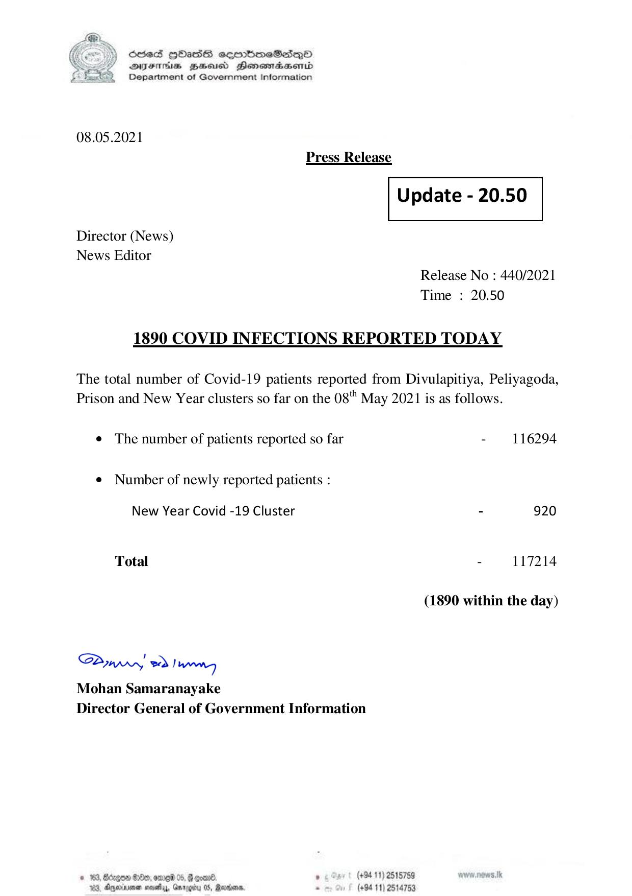

# Press Release - 2021.05.08 
Key: 32c6c63019f0faa150a44943ea63d003 

---
```
) ScdeS HOadS cermbmeSsdQo
SUES Zeid Henesrdaembd
Department of Government Information

 

08.05.2021
Press Release

 

Update - 20.50

 

 

 

Director (News)
News Editor

Release No : 440/2021
Time : 20.50

1890 COVID INFECTIONS REPORTED TODAY

The total number of Covid-19 patients reported from Divulapitiya, Peliyagoda,
Prison and New Year clusters so far on the 08" May 2021 is as follows.

¢ The number of patients reported so far - 116294

¢ Number of newly reported patients :

New Year Covid -19 Cluster - 920
Total - 117214
(1890 within the day)

Saw eo) wenn
Mohan Samaranayake
Director General of Government Information

© 163, Bcrgow $80, omreid 05,  coan® , (+94 11) 2515789
183, Aperinsna sasety, Gnrogiry 05, Racers - (+94 11) 2514753

```
