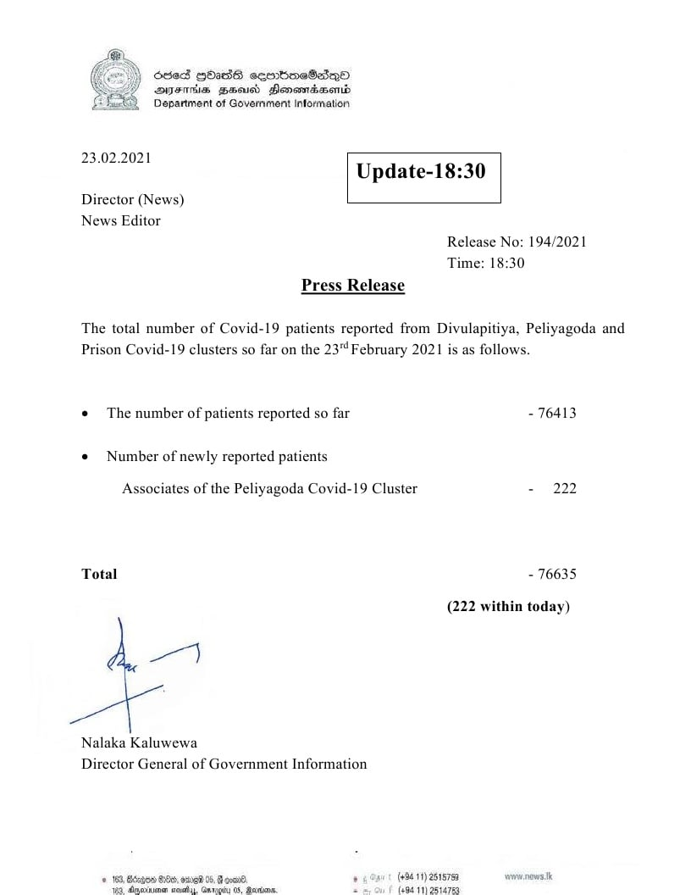

# Press Release - 2021.02.23 
Key: 33165cc0f85260e75de541dc3a2f799f 

---
```
Ssed Gbi36 eemboeBdQo
suena gaoiss Dansmncbasmb
EEE Deparment of Government information

  

 

Aen Update-18:30

 

 

Director (News)
News Editor

 

Release No: 194/2021
Time: 18:30
Press Release
The total number of Covid-19 patients reported from Divulapitiya, Peliyagoda and
Prison Covid-19 clusters so far on the 23" February 2021 is as follows.

© The number of patients reported so far - 76413

«© Number of newly reported patients

Associates of the Peliyagoda Covid-19 Cluster - 222

Total - 76635

(222 within today)

wy

Nalaka Kaluwewa
Director General of Government Information

1 168, ios BO, ose 0, nae One (11) 25ts7s9 ven paws
ton deatiiats aula, Gauls 0k: Sinden: z (e089) 26147:

```
