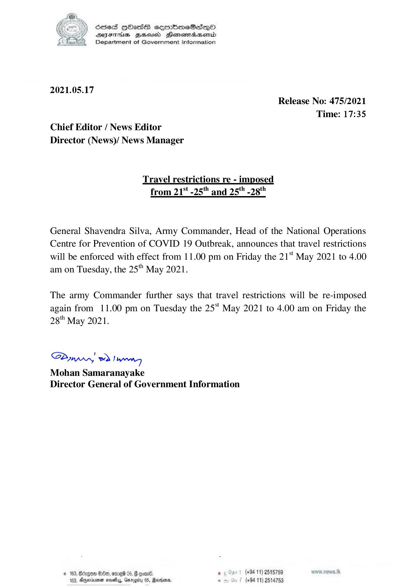

# Press Release - 2021.05.17 - Travel restrictions re - imposed from 21st - 25th and 25th - 28th 
Key: 332290212211ebc4b8a1ccc16e50ce2b 

---
```
|) OcsedS HOasdS combmeSano
DYES ZaHsicd PHenomadbasemd
Department of Government Information

 

2021.05.17
Release No: 475/2021

Time: 17:35
Chief Editor / News Editor
Director (News)/ News Manager

Travel restrictions re - imposed
from 21% -25" and 25" -28"

General Shavendra Silva, Army Commander, Head of the National Operations
Centre for Prevention of COVID 19 Outbreak, announces that travel restrictions
will be enforced with effect from 11.00 pm on Friday the 21‘ May 2021 to 4.00
am on Tuesday, the 25" May 2021.

The army Commander further says that travel restrictions will be re-imposed
again from 11.00 pm on Tuesday the 25* May 2021 to 4.00 am on Friday the
28" May 2021.

Saw > Inn
Mohan Samaranayake
Director General of Government Information

© 1633, Borgen Odo, ome 05, G coe. » «Sy | (496-11) 2515759
163, Ageiuene soahy, Garotu 05, Rardns. - (+94 11) 2514753

```
