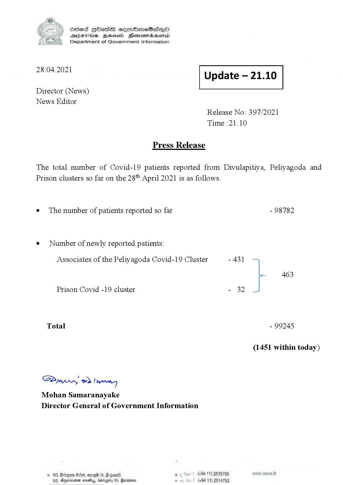

# Press Release - 2021.04.28 
Key: 33ee0ac4bee6da670095b11c36499f18 

---
```
S) ScseS HOasdS cerrbmeSdQo
SVsThis geod Henssnadasombd
Department of Government Information

 

 

28.04.2021 Update — 21.10

 

 

 

Director (News)

News Editor
Release No: 397/2021
Time :21.10

Press Release
The total number of Covid-19 patients reported from Divulapitiya, Peliyagoda and
Prison clusters so far on the 28" April 2021 is as follows.

e The number of patients reported so far - 98782

¢ Number of newly reported patients:

Associates of the Peliyagoda Covid-19 Cluster - 431
463
Prison Covid -19 cluster - 32
Total - 99245
(1451 within today)

Saw, > Inn
Mohan Samaranayake
Director General of Government Information

goad, . (+94 11) 2515789
05, Renin, - (+94 11) 2514753

© 163, Borgo $200, ome 05, @
163, Agora sosethys, Gar,

  

```
