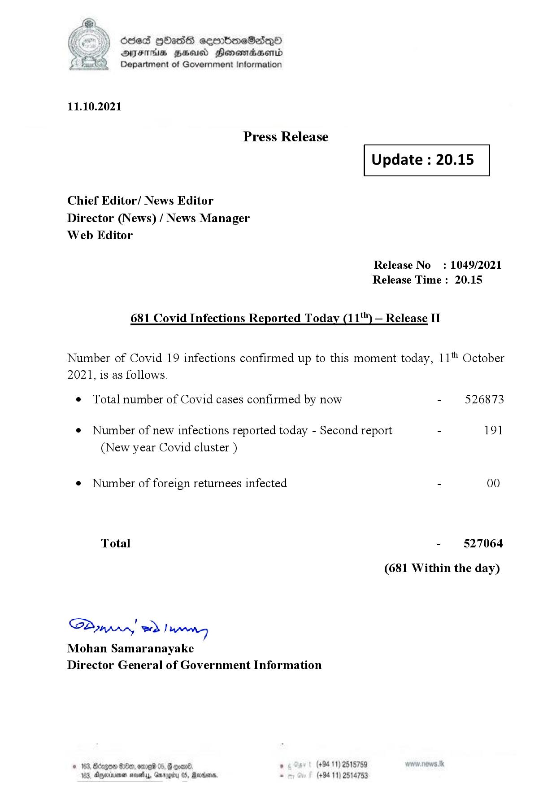

# Press Release  - 2021.10.11 - Covid 19 Infection Report 
Key: 34adf8e0f72c38708a9723d55136d63b 

---
```
dosed GOass eemmbmeSadepO
DFS BHU Honswnradasentd
Department of Government Information

 

 

11.10.2021

Press Release

Chief Editor/ News Editor
Director (News) / News Manager
Web Editor

 

 

Update : 20.15

 

 

Release No

: 1049/2021

Release Time : 20.15

681 Covid Infections Reported Today (11*") — Release II

Number of Covid 19 infections confirmed up to this moment today, 11" October

2021, is as follows.

¢ Total number of Covid cases confirmed by now

¢ Number of new infections reported today - Second report

(New year Covid cluster )

¢ Number of foreign returnees infected

Total

SP nprrn wd Ianwng
Mohan Samaranayake
Director General of Government Information

 

. (+94 11) 2515759
(+94 11) 2514753

526873

191

00

527064

(681 Within the day)

```
