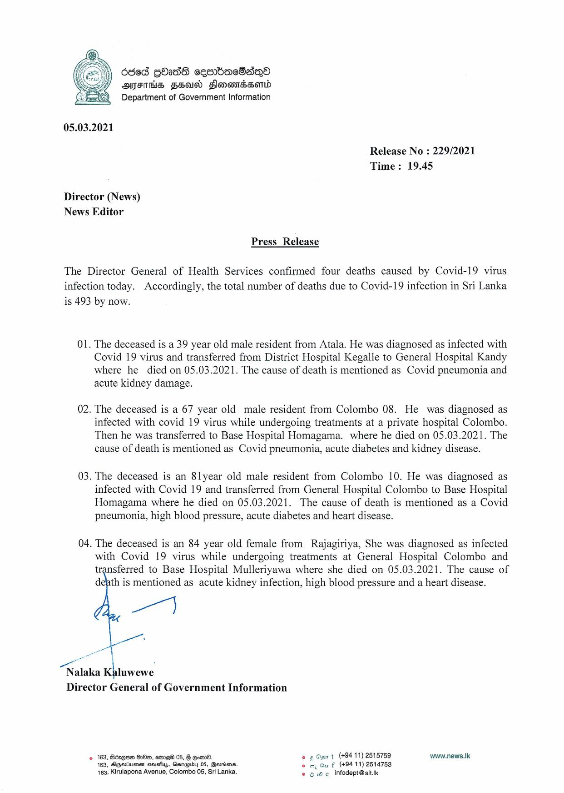

# Press Release - 2021.03.05 - Covid 19 infection deaths 
Key: 351381ac9f321397a3c684cee769cebe 

---
```
 

05.03.2021

Release No : 229/2021
Time: 19.45

Director (News)
News Editor

Press Release

The Director General of Health Services confirmed four deaths caused by Covid-19 virus
infection today. Accordingly, the total number of deaths due to Covid-19 infection in Sri Lanka
is 493 by now.

01. The deceased is a 39 year old male resident from Atala. He was diagnosed as infected with
Covid 19 virus and transferred from District Hospital Kegalle to General Hospital Kandy
where he died on 05.03.2021. The cause of death is mentioned as Covid pneumonia and
acute kidney damage.

02. The deceased is a 67 year old male resident from Colombo 08. He was diagnosed as
infected with covid 19 virus while undergoing treatments at a private hospital Colombo.
Then he was transferred to Base Hospital Homagama. where he died on 05.03.2021. The
cause of death is mentioned as Covid pneumonia, acute diabetes and kidney disease.

03. The deceased is an 8lyear old male resident from Colombo 10. He was diagnosed as
infected with Covid 19 and transferred from General Hospital Colombo to Base Hospital
Homagama where he died on 05.03.2021. The cause of death is mentioned as a Covid
pneumonia, high blood pressure, acute diabetes and heart disease.

04. The deceased is an 84 year old female from Rajagiriya, She was diagnosed as infected
with Covid 19 virus while undergoing treatments at General Hospital Colombo and
transferred to Base Hospital Mulleriyawa where she died on 05.03.2021. The cause of
defth is mentioned as acute kidney infection, high blood pressure and a heart disease.

pe

   
 

a
Nalaka Kaluwewe
Director General of Government Information

«168, Béeque BOs, sme 05, 8 goed. oe Opn t (+9411) 2515759 www.news.Ik
163, Agertiumen scushys, Gsrapiby 05, Bevdisns. © my Gu f (+94 11) 2514753
463, Kirulapona Avenue, Colombo 05, Sri Lanka. © owe infodept@stt.ik

```
