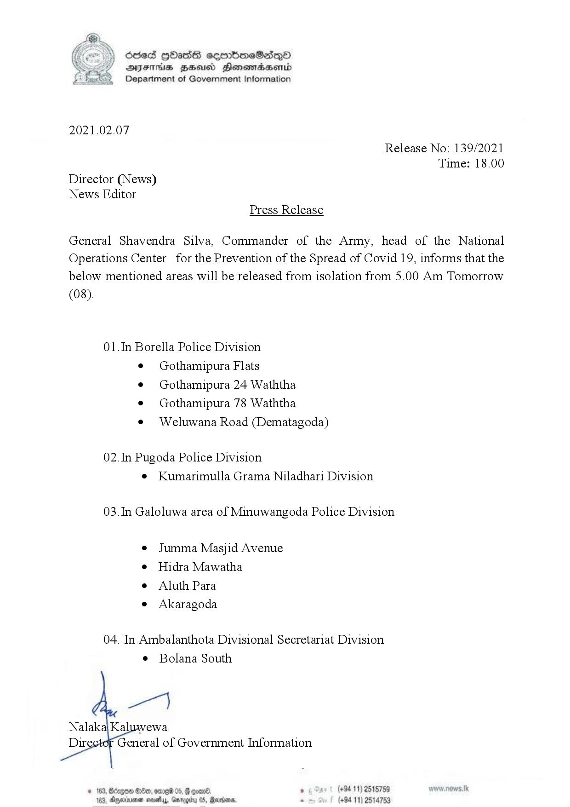

# Press Release - 2021.02.07  -Released from Isolation 
Key: 35836d95244b3a5b8de175982b73758e 

---
```
6sed 9Hass cembmeSedq—QO
AIFS BHU Honewmadsentd
Department of Government Information

 

2021.02.07

Release No: 139/2021
Time: 18.00
Director (News)
News Editor
Press Release

General Shavendra Silva, Commander of the Army, head of the National
Operations Center for the Prevention of the Spread of Covid 19, informs that the
below mentioned areas will be released from isolation from 5.00 Am Tomorrow
(08).

01.In Borella Police Division
¢ Gothamipura Flats
¢ Gothamipura 24 Waththa
¢ Gothamipura 78 Waththa
¢ Weluwana Road (Dematagoda)

02.In Pugoda Police Division
¢ Kumarimulla Grama Niladhari Division

03.In Galoluwa area of Minuwangoda Police Division

¢ Jumma Masjid Avenue
e Hidra Mawatha

e Aluth Para

e Akaragoda

04. In Ambalanthota Divisional Secretariat Division
¢ Bolana South

 

© 163, Borgen S80, ome 05, @ gon. , (+9411) 2515759
103, Dexia noes, Gwrogiiy 0S, Merde. . (+94 11) 2514753

```
