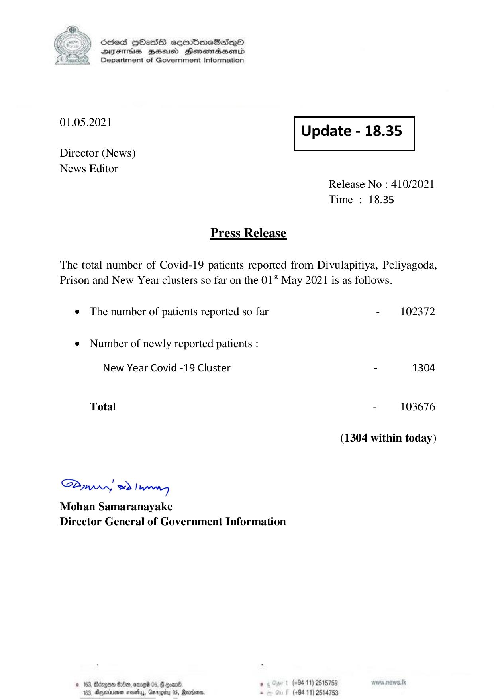

# Press Release - 2021.05.01 
Key: 36d5e4ef02aa170834e43fccc0132d1c 

---
```
) ScdeS HOadS cermbmeSsdQo
DVEFIHS HHosd Honomabsenid
Department of Government Information

 

 

01.05.2021 Update - 18.35

 

 

 

Director (News)

News Editor
Release No : 410/2021
Time : 18.35

Press Release

The total number of Covid-19 patients reported from Divulapitiya, Peliyagoda,
Prison and New Year clusters so far on the 01 May 2021 is as follows.

¢ The number of patients reported so far - 102372

¢ Number of newly reported patients :

New Year Covid -19 Cluster - 1304
Total - 103676
(1304 within today)

Saw 2) wn
Mohan Samaranayake
Director General of Government Information

© 163, Bécgon G0, ome 05, & good ’ (+94 11) 2518759
163, Agere sesty, Gxrogitu 05, Rariens - (+94 11) 2514753

```
