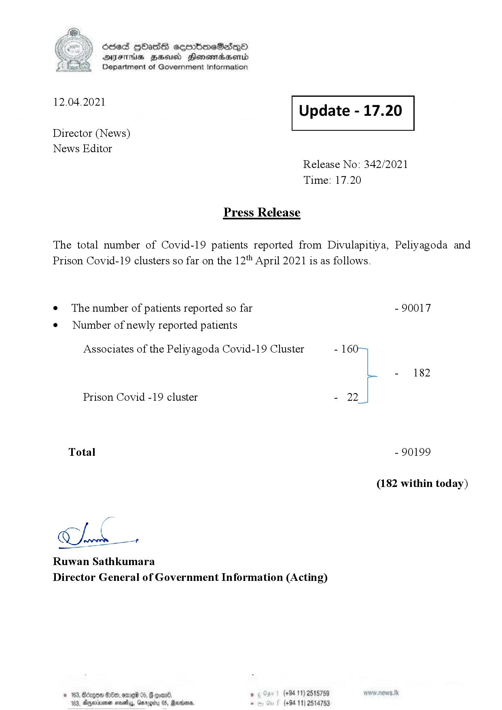

# Press Release - 2021.04.12 
Key: 37fcc3460feeedff49ff8f1324deeb93 

---
```
\) O63 GOadS ceortimeSzdQO
AIFS BHU Henewmadasentd
Department of Government Information

 

 

12.04.2021 Update - 17.20

 

 

 

Director (News)

News Editor
Release No: 342/2021
Time: 17.20

Press Release

The total number of Covid-19 patients reported from Divulapitiya, Peliyagoda and
Prison Covid-19 clusters so far on the 12" April 2021 is as follows.

e The number of patients reported so far - 90017

¢ Number of newly reported patients

Associates of the Peliyagoda Covid-19 Cluster - 16
- 182
Prison Covid -19 cluster - 22
Total - 90199
(182 within today)

Chak

Ruwan Sathkumara

 

Director General of Government Information (Acting)

© 163, degen 0, ore 05, @ goand ° (+94 11) 2515759
163, Aparna nasty, Garogiry 0S, Rerrioare, . (+94 11) 2514753

```
