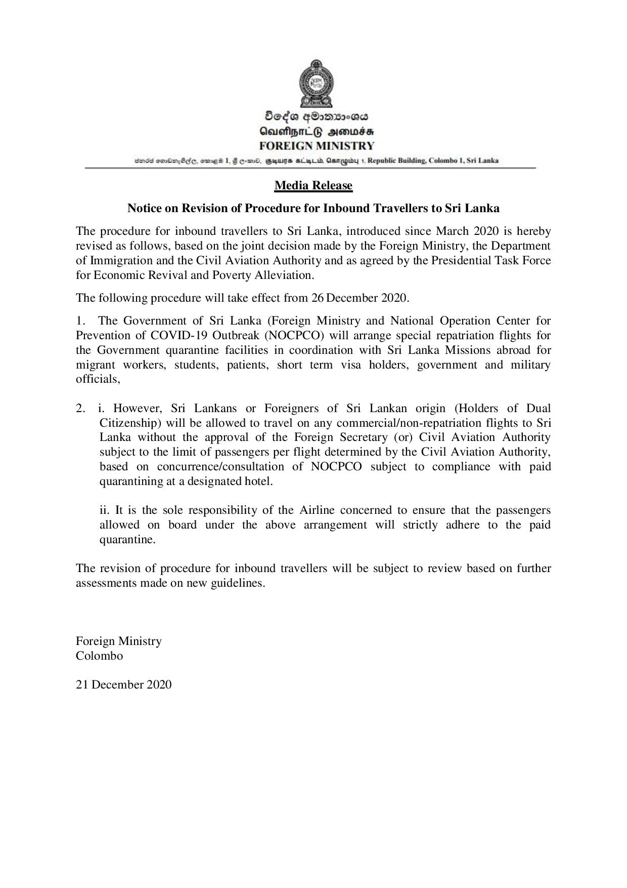

# Press Release -2020.12.21 - Foreign Ministry 
Key: 380087d4db1b6f0475aa8ad6eb704031 

---
```
 

Seda g®onxs°as
Aeuefpm_G simwss
FOREIGN MINISTRY

Sorsd emrOa, Bde, ome 1G c-mr0, Gus Sug ih Aanepiby 1, Republic Building, Colombo 1, Sri Lanka

 

Media Release
Notice on Revision of Procedure for Inbound Travellers to Sri Lanka

The procedure for inbound travellers to Sri Lanka, introduced since March 2020 is hereby
revised as follows, based on the joint decision made by the Foreign Ministry, the Department
of Immigration and the Civil Aviation Authority and as agreed by the Presidential Task Force
for Economic Revival and Poverty Alleviation.

The following procedure will take effect from 26 December 2020.

1. The Government of Sri Lanka (Foreign Ministry and National Operation Center for
Prevention of COVID-19 Outbreak (NOCPCO) will arrange special repatriation flights for
the Government quarantine facilities in coordination with Sri Lanka Missions abroad for
migrant workers, students, patients, short term visa holders, government and military
officials,

2. i. However, Sri Lankans or Foreigners of Sri Lankan origin (Holders of Dual
Citizenship) will be allowed to travel on any commercial/non-repatriation flights to Sri
Lanka without the approval of the Foreign Secretary (or) Civil Aviation Authority
subject to the limit of passengers per flight determined by the Civil Aviation Authority,
based on concurrence/consultation of NOCPCO subject to compliance with paid
quarantining at a designated hotel.

ii. It is the sole responsibility of the Airline concerned to ensure that the passengers
allowed on board under the above arrangement will strictly adhere to the paid

quarantine.

The revision of procedure for inbound travellers will be subject to review based on further
assessments made on new guidelines.

Foreign Ministry
Colombo

21 December 2020

```
