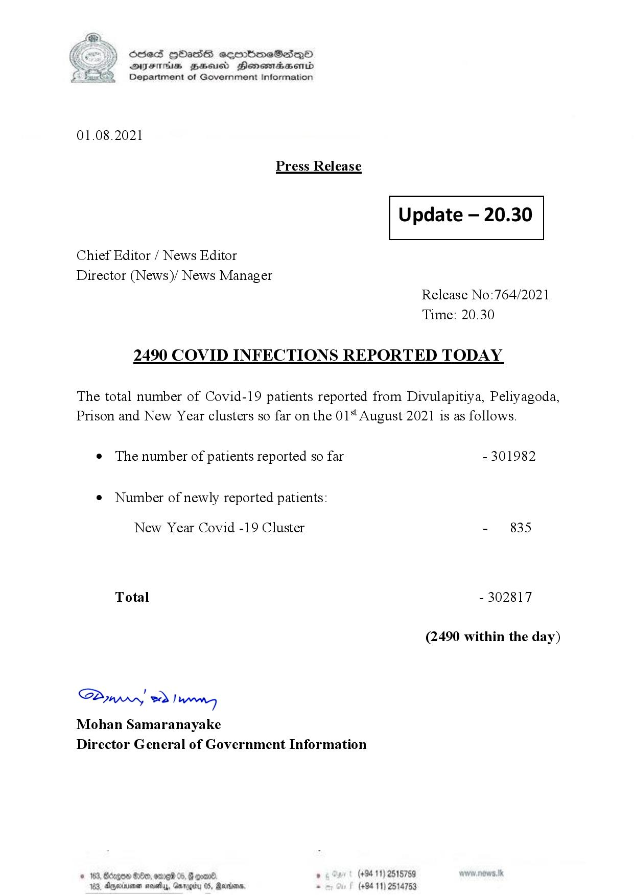

# Press Release - 2021.08.01 - Covid 19 Infection Report 
Key: 39fc8f2c5f842ce70938e83ba7d7a5b5 

---
```
(6 S) ScseS HOasdS cerrbmeSdQo
DFTs BHEosd Henewtaeasernid
Department of Government Information

 

01.08.2021

Press Release

 

Update — 20.30

 

 

 

Chief Editor / News Editor

Director (News)/ News Manager
Release No:764/2021
Time: 20.30

2490 COVID INFECTIONS REPORTED TODAY

The total number of Covid-19 patients reported from Divulapitiya, Peliyagoda,
Prison and New Year clusters so far on the 01" August 2021 is as follows.

e The number of patients reported so far - 301982

¢ Number of newly reported patients:

New Year Covid -19 Cluster - 835
Total - 302817
(2490 within the day)

Saw 2) won,
Mohan Samaranayake
Director General of Government Information

© 163, Bdegon G80, ome 0 6 ’ (+94 11) 2515759
163, Agere naethy, Gmrogiby 05, Rereisons, - (+94 11) 2514753

 

```
