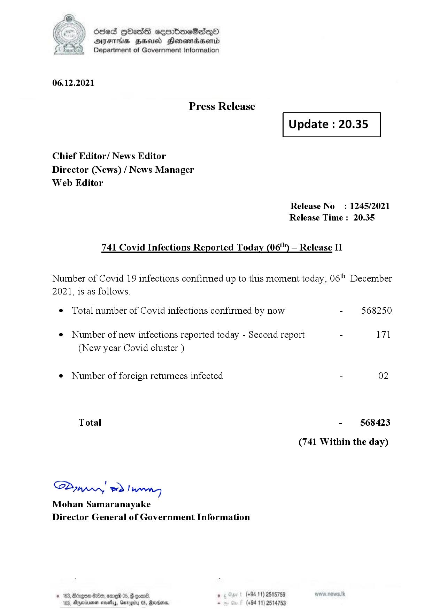

# Press Release - 2021.12.06  - Covid 19 Infection Report 
Key: 3a1a36b44e722c2de0e1e0e2df08eac9 

---
```
dosed GOass eemmbmeSadepO
DFS BHU Honswnradasentd
Department of Government Information

 

 

06.12.2021

Press Release

 

Update : 20.35

 

 

 

Chief Editor/ News Editor
Director (News) / News Manager
Web Editor

Release No: 1245/2021
Release Time : 20.35

741 Covid Infections Reported Today (06) — Release II

Number of Covid 19 infections confirmed up to this moment today, 06" December
2021, is as follows.

¢ Total number of Covid infections confirmed by now - 568250

¢ Number of new infections reported today - Second report - 171
(New year Covid cluster )

¢ Number of foreign returnees infected - 02

Total - 568423
(741 Within the day)

SP nprrn wd Ianwng
Mohan Samaranayake
Director General of Government Information

. (+94 11) 2515759
(+94 11) 2514753

 

```
