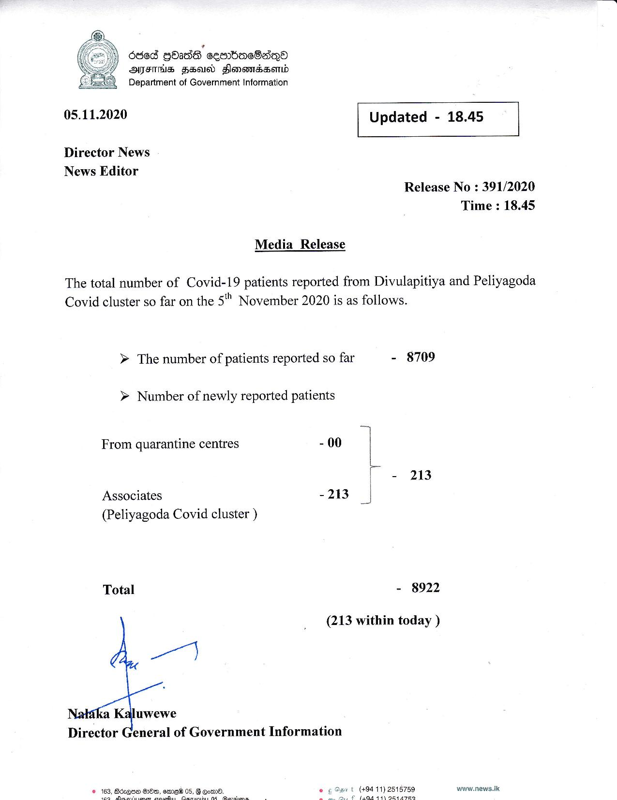

# Press Release - 2020.11.05 
Key: 3a2ec2b0291cb85d5111542c7bcbb4a9 

---
```
’
dde8 GOadG sesWacSasQo
OFT HSU Honomtadsomd
Department of Government Information

05.11.2020

Director News
News Editor
Release No : 391/2020
Time : 18.45

Media Release

The total number of Covid-19 patients reported from Divulapitiya and Peliyagoda

Covid cluster so far on the 5" November 2020 is as follows.

> The number of patients reported so far - 8709

 

```
