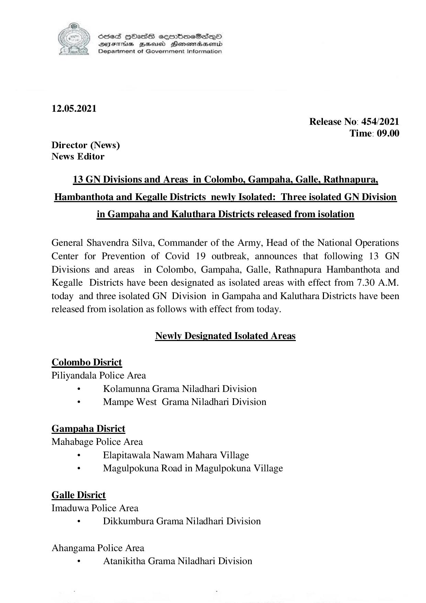

# Press Release - 2021.05.12 - Isolated lifting and newly isolated areas 
Key: 3a5ce36a645ce69fbb7900324c151e11 

---
```
6536S HODsASHS sermbdmeSs~o
DFTs BHousd Henombaend
Department of Government Information

 

12.05.2021
Release No: 454/2021
Time: 09.00
Director (News)
News Editor

13_GN Divisions and Areas_in Colombo, Gampaha, Galle, Rathnapura,
Hambanthota and Kegalle Districts_newly Isolated: Three isolated GN Division

in Gampaha and Kaluthara Districts released from isolation

General Shavendra Silva, Commander of the Army, Head of the National Operations
Center for Prevention of Covid 19 outbreak, announces that following 13 GN
Divisions and areas in Colombo, Gampaha, Galle, Rathnapura Hambanthota and
Kegalle Districts have been designated as isolated areas with effect from 7.30 A.M.
today and three isolated GN Division in Gampaha and Kaluthara Districts have been
released from isolation as follows with effect from today.

Newly Designated Isolated Areas

Colombo Disrict
Piliyandala Police Area
. Kolamunna Grama Niladhari Division
s Mampe West Grama Niladhari Division

Gampaha Disrict
Mahabage Police Area

. Elapitawala Nawam Mahara Village
. Magulpokuna Road in Magulpokuna Village

Galle Disrict
Imaduwa Police Area
. Dikkumbura Grama Niladhari Division

Ahangama Police Area
. Atanikitha Grama Niladhari Division

```
