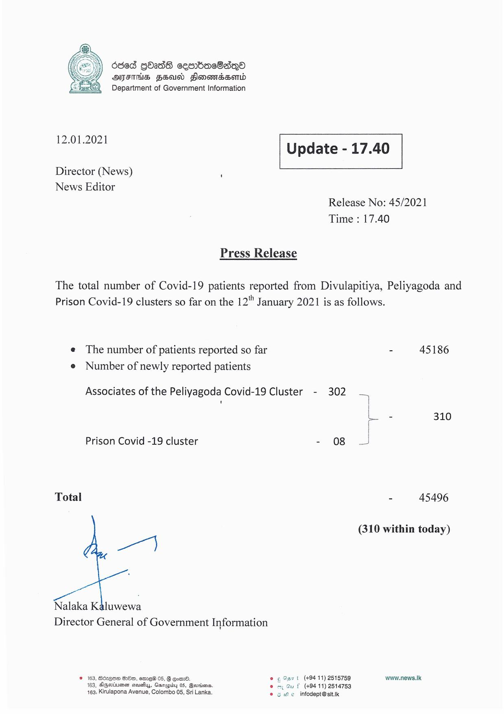

# Press Release - 2021.01.12 
Key: 3b215dab63608ad285aade761dc0768a 

---
```
6865 GbaddS cesrbac8aqea
OFS FH Honondssomd
Department of Government Information

 

 

12.01.2021 Update - 17.40

 

 

 

Director (News) ‘

News Editor
Release No: 45/2021

Time : 17.40

Press Release

The total number of Covid-19 patients reported from Divulapitiya, Peliyagoda and
Prison Covid-19 clusters so far on the 12" January 2021 is as follows.

e The number of patients reported so far - 45186
e Number of newly reported patients

Associates of the Peliyagoda Covid-19 Cluster - 302 —

)
ba 310
|
Prison Covid -19 cluster - 08
Total - 45496
(310 within today)
Nalaka Kaluwewa
Director General of Government Information
© 163, Bdcvese OOo, em_eW 05, § com. © 6 Sart (+9411) 2515759 www.news.Ik

u { (49411) 2514753
e infodept@sit.ik

163, AeGevtiuenen acuahuy, Garapiby 05, Gevriens. .
163, Kirulapona Avenue, Colombo 05, Sri Lanka. es

  

```
