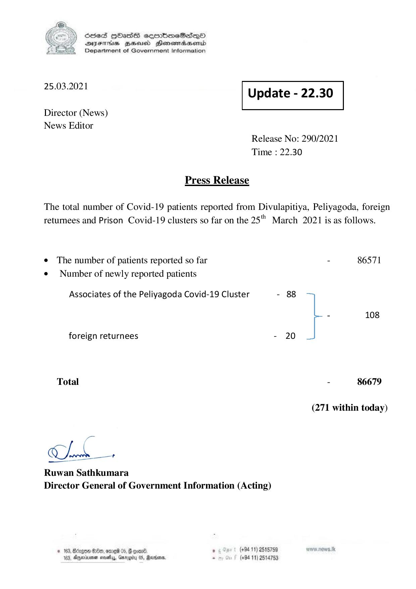

# Press Release - 2021.03.25 
Key: 3b8728db155816ace3d076676bc926de 

---
```
) ScdeS HOadS cermbmeSsdQo
DVEFIHS HHosd Honomabsenid
Department of Government Information

 

 

25.03.2021 Update - 22.30

 

 

 

Director (News)

News Editor
Release No: 290/2021
Time : 22.30

Press Release
The total number of Covid-19 patients reported from Divulapitiya, Peliyagoda, foreign

returnees and Prison Covid-19 clusters so far on the 25" March 2021 is as follows.

e The number of patients reported so far - 86571
¢ Number of newly reported patients

Associates of the Peliyagoda Covid-19 Cluster - 88
- 108

foreign returnees - 20
Total - 86679

(271 within today)

ne +

Ruwan Sathkumara
Director General of Government Information (Acting)

© 163, Bdegoe #8, omrei 05,  coan® , (+94 11) 2515789
183, Dnexima nays, Garogity 05, Marion, . (+94 11) 2514753

```
