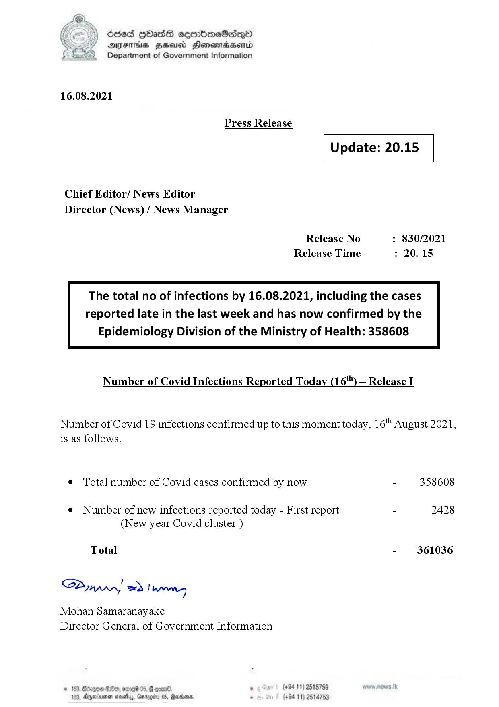

# Press Release  - 2021.08.16 
Key: 3b8fff686b5f2a5132f7dbf79a1cb804 

---
```
6863 GOasds sembmeSadqQo
AIFS HSA Honomasentd
Department of Government Information

 

16.08.2021

Press Release

 

Update: 20.15

 

 

 

Chief Editor/ News Editor
Director (News) / News Manager

Release No : 830/2021
Release Time : 20.15

The total no of infections by 16.08.2021, including the cases
reported late in the last week and has now confirmed by the

 

Epidemiology Division of the Ministry of Health: 358608

Number of Covid Infections Reported Today (16") — Release I

Number of Covid 19 infections confirmed up to this moment today, 16" August 2021,
is as follows,

¢ Total number of Covid cases confirmed by now

- 358608

¢ Number of new infections reported today - First report - 2428
(New year Covid cluster )

Total - 361036

SAmprn wd Darwen
Mohan Samaranayake
Director General of Government Information

. (+94 11) 2515759
(+94 11) 2514753

 

```
