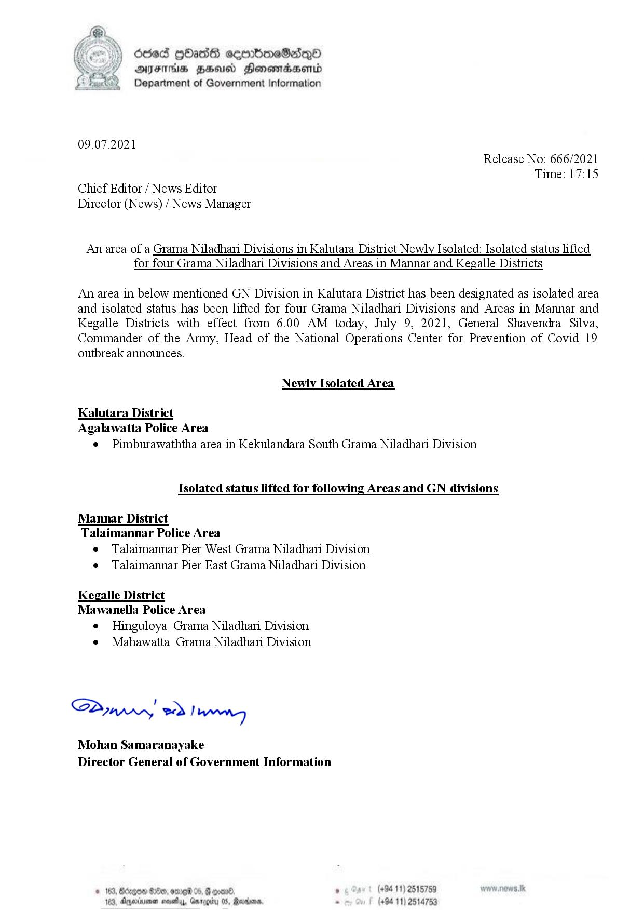

# Press Release - 2021.07.09 - Newly Isolated Areas & Isolated status lifting Areas 
Key: 3c1072396261c3d543efac24b10ca38d 

---
```
(oe) Sed [bas ceenbneSadqnO
\ Y DAYS HZHousd Honowraaenid
Department of Government Information

 

09.07.2021

Release No: 666/2021

Chief Editor / News Editor
Director (News) / News Manager

Time: 17:15

An area of a Grama Niladhari Divisions in Kalutara District Newly Isolated: Isolated status lifted
for four Grama Niladhari Divisions and Areas in Mannar and Kegalle Districts

An area in below mentioned GN Division in Kalutara District has been designated as isolated area
and isolated status has been lifted for four Grama Niladhari Divisions and Areas in Mannar and
Kegalle Districts with effect from 6.00 AM today, July 9, 2021, General Shavendra Silva,
Commander of the Army, Head of the National Operations Center for Prevention of Covid 19

outbreak announces.

Newly Isolated Area

Kalutara District
Agalawatta Police Area

e = Pimburawaththa area in Kekulandara South Grama Niladhani Division

Isolated status lifted for following Areas and GN divisions

Mannar District
Talaimannar Police Area

e Talaimannar Pier West Grama Niladhari Division.
¢ Talaimannar Pier East Grama Niladhari Division.

Kegalle District
Mawanella Police Area

e Hinguloya Grama Niladhari Division
e¢ Mahawatta Grama Niladhari Division

Syn, ed) wn

Mohan Samaranayake
Director General of Government Information

. (+94 11) 2515759
(+94 11) 2514753

 

```
