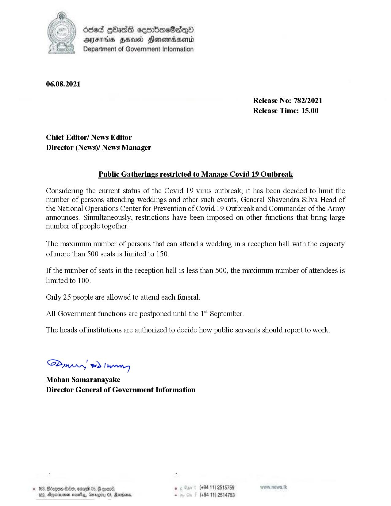

# Press Release - 2021.08.06 - Public Gathering restricted to Manage Covid 19 Outbreak 
Key: 3c5a246ac357490087a10b264ec8906d 

---
```
(cr) bed 90288 eeerboneSedqQ®
AFIS HHA Honewrcaertd
Department of Government Information

 

06.08.2021

Release No: 782/2021
Release Time: 15.00

Chief Editor/ News Editor
Director (News)/ News Manager

Public Gatherings restricted to Manage Covid 19 Outbreak

Considering the current status of the Covid 19 virus outbreak, it has been decided to limit the
number of persons attending weddings and other such events, General Shavendra Silva Head of
the National Operations Center for Prevention of Covid 19 Outbreak and Commander of the Army
announces. Simultaneously, restrictions have been imposed on other functions that bring large
number of people together.

The maximum number of persons that can attend a wedding in a reception hall with the capacity
of more than 500 seats is limited to 150.

If the number of seats in the reception hall is less than 500, the maximum number of attendees is
limited to 100.

Only 25 people are allowed to attend each funeral.
All Government functions are postponed until the 1‘! September.

The heads of institutions are authorized to decide how public servants should report to work.

Saw 2) won,
Mohan Samaranayake
Director General of Government Information

. (+94 11) 2515759
- (+94 11) 2514753

 

```
