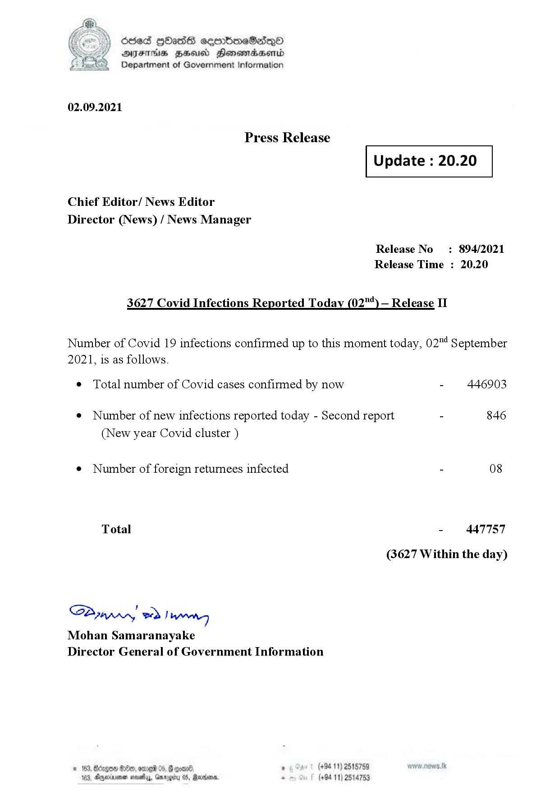

# Press Release - 2021.09.02 - Covid 19 Infection Report 
Key: 3c864d70967bc6640f04338cf0247504 

---
```
dosed GOass eemmbmeSadepO
DFS BHU Honswnradasentd
Department of Government Information

 

 

02.09.2021

Press Release

Chief Editor/ News Editor
Director (News) / News Manager

3627 Covid Infections Reported Today (02") — Release II

 

 

Update : 20.20

 

 

Release No

: 894/2021

Release Time : 20.20

Number of Covid 19 infections confirmed up to this moment today, 02"4 September

2021, is as follows.

¢ Total number of Covid cases confirmed by now

¢ Number of new infections reported today - Second report -

(New year Covid cluster )

¢ Number of foreign returnees infected

Total

SPynprn wd Ing
Mohan Samaranayake
Director General of Government Information

  

© 163, Bdagon Oo, ome

6 * (+94 11) 2515759
103, Ajerinenen mosey, arog 08, Marion . (+94 11) 2514753

446903

846

08

447757

(3627 Within the day)

```
