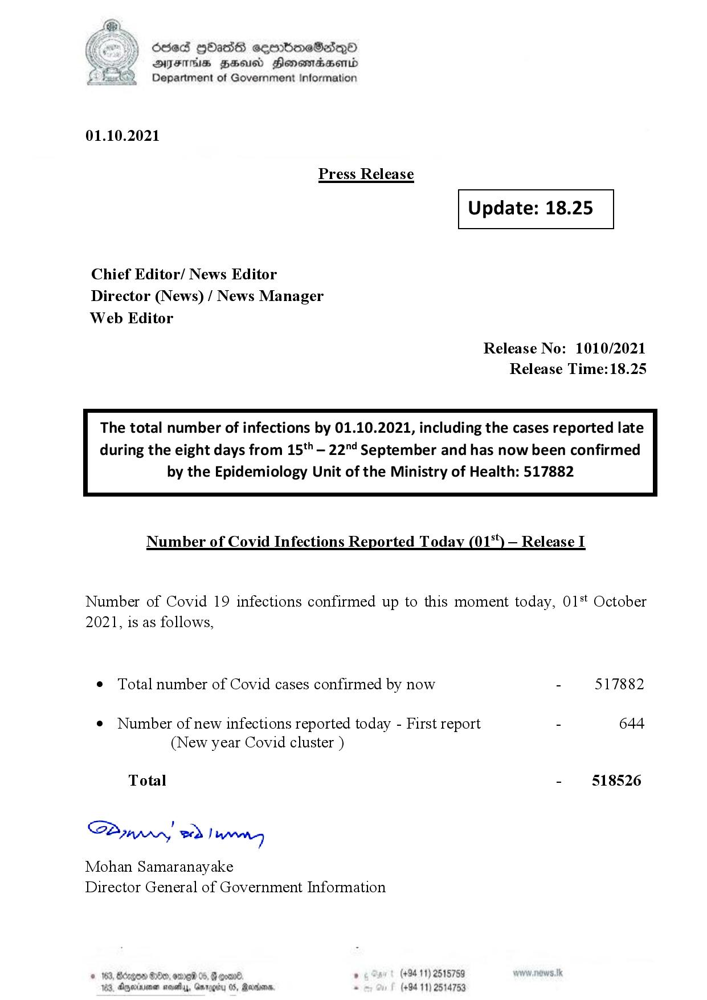

# Press Release - 2021.10.01 
Key: 3dc48ac196fa7a447d73137cab1e83c4 

---
```
dosed Hbash sermimeSadeqyO
ATITHIS BHU Honowmadsertd
Department of Government Information

 

01.10.2021

Press Release

 

Update: 18.25

 

 

 

Chief Editor/ News Editor
Director (News) / News Manager
Web Editor

Release No: 1010/2021
Release Time:18.25

The total number of infections by 01.10.2021, including the cases reported late
during the eight days from 15'* — 22"4 September and has now been confirmed

by the Epidemiology Unit of the Ministry of Health: 517882

 

Number of Covid Infections Reported Today (01%) — Release I

Number of Covid 19 infections confirmed up to this moment today, 01%t October
2021, is as follows,

e Total number of Covid cases confirmed by now - 517882

¢ Number of new infections reported today - First report - 644
(New year Covid cluster )

Total - 518526

Bunn, eed | cael

Mohan Samaranayake
Director General of Government Information

(+94 11) 2515759
hiss, Garggity 05, Raxiome . (+84 11) 2514753

 

 

33, nyeinsonen

 

```
