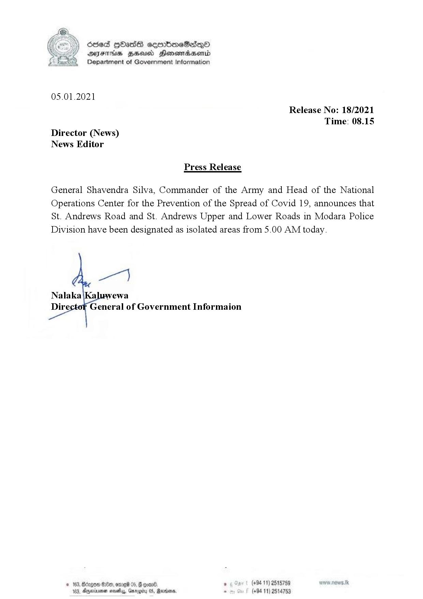

# Press Release - 2021.01.05 - St andrews road, St andrews upper and lower road in modara designated as isolated 
Key: 3df0694f5ce0a90d51dad0fcce988806 

---
```
 

Ssed HOHasG sermbmeSadqQo
AIFS BHU Honemtadaentd
Department of Government Information

 

05.01.2021

Release No: 18/2021
Time: 08.15
Director (News)
News Editor

Press Release

General Shavendra Silva, Commander of the Army and Head of the National
Operations Center for the Prevention of the Spread of Covid 19, announces that
St. Andrews Road and St. Andrews Upper and Lower Roads in Modara Police
Division have been designated as isolated areas from 5.00 AM today.

 

S00, ore 05, G goa. , (+94 11) 2515759 wwrw now Jk

© 163, &
183, Anmineen samy, Garogity 05, Sanonm, . (+94 11) 2514753

 

```
