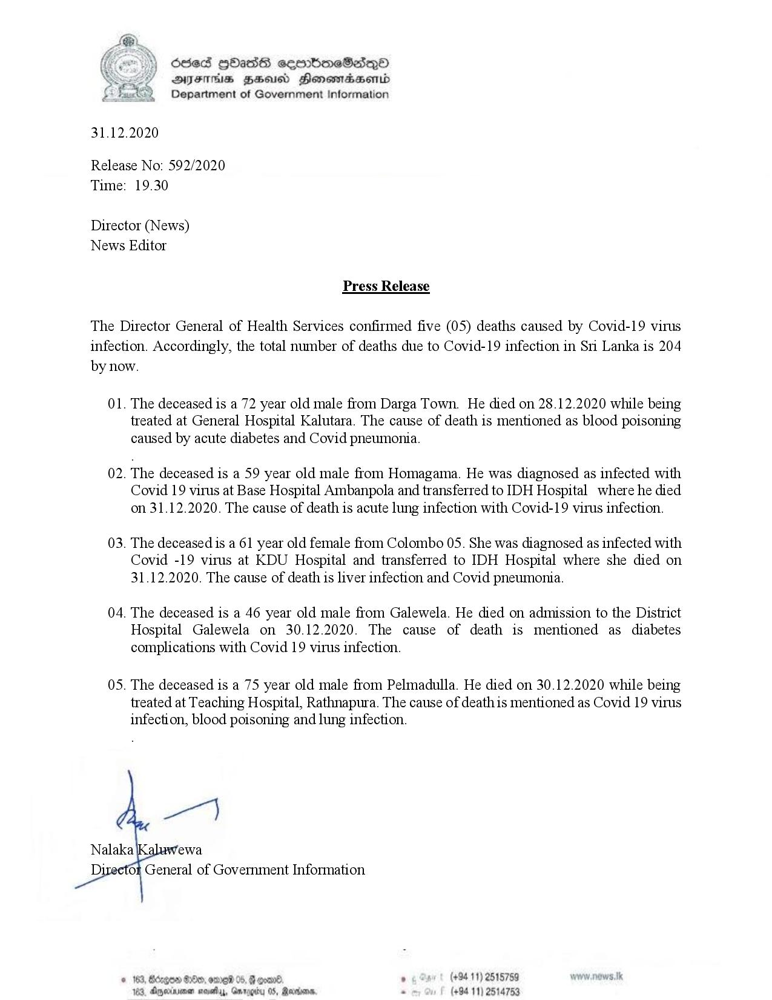

# Press Release - 2020.12.31- 05 Covid 19 infection deaths has been reported, total number of deaths rises to 204 
Key: 3ec7cea834829a028d18a993ef561ac2 

---
```
 

odes HHasG cermbmeSadqQ0®
DFS HSU Honowtradasentd
Department of Government Information

31.12.2020

Release No: 592/2020
Time: 19.30

Director (News)
News Editor

Press Release

The Director General of Health Services confirmed five (05) deaths caused by Covid-19 virus
infection. Accordingly, the total number of deaths due to Covid-19 infection in Sri Lanka is 204
by now.

01. The deceased is a 72 year old male from Darga Town. He died on 28.12.2020 while being

treated at General Hospital Kalutara. The cause of death is mentioned as blood poisoning
caused by acute diabetes and Covid pneumonia.

02. The deceased is a 59 year old male from Homagama. He was diagnosed as infected with

Covid 19 virus at Base Hospital Ambanpola and transferred to IDH Hospital where he died
on 31.12.2020. The cause of death is acute lung infection with Covid-19 virus infection.

03. The deceased is a 61 year old female from Colombo 05. She was diagnosed as infected with

Covid -19 virus at KDU Hospital and transferred to IDH Hospital where she died on
31.12.2020. The cause of death is liver infection and Covid pneumonia.

04. The deceased is a 46 year old male from Galewela. He died on admission to the District

Hospital Galewela on 30.12.2020. The cause of death is mentioned as diabetes
complications with Covid 19 virus infection.

05. The deceased is a 75 year old male from Pelmadulla. He died on 30.12.2020 while being

treated at Teaching Hospital, Rathnapura. The cause of deathis mentioned as Covid 19 virus
infection, blood poisoning and lung infection.

per)

Nalaka ‘ewa

Di

‘or General of Government Information

. (+94 11) 2515759 " w.1k

© 163, Bdrgon G0e0, ome 05. § >,
Barons. - (+94 11) 2514753

123, dgeineen novaay, Gw

 

 

```
