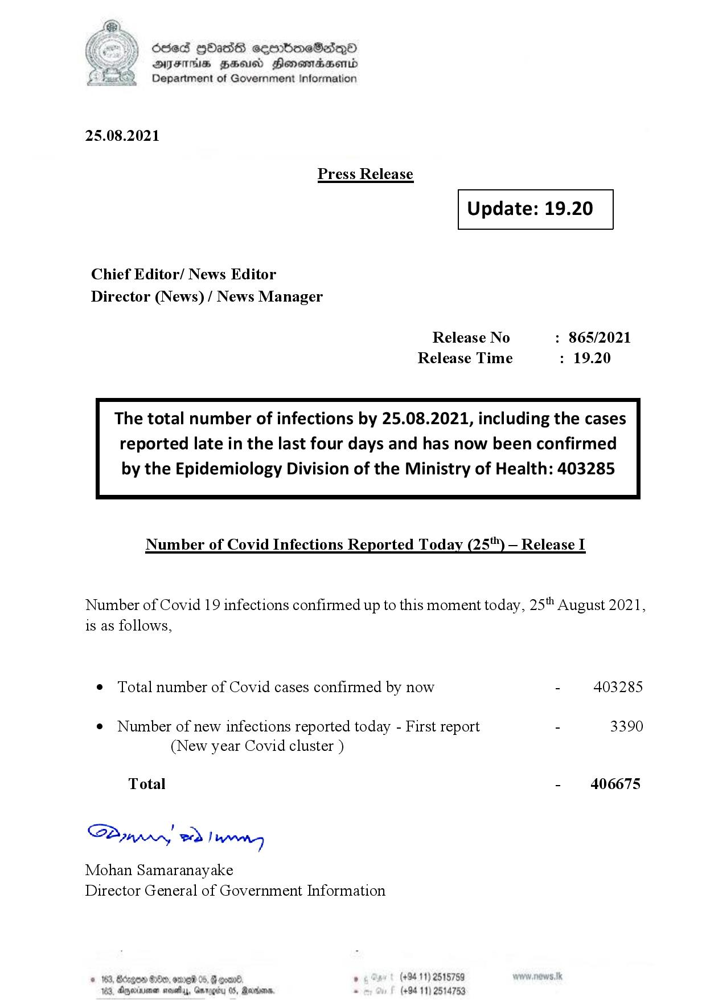

# Press Release - 2021.08.25 
Key: 3f27b256123a7336403a17710fc1890a 

---
```
6863 GOasds sembmeSadqQo
AIFS HSA Honomasentd
Department of Government Information

 

25.08.2021

Press Release

 

Update: 19.20

 

 

 

Chief Editor/ News Editor
Director (News) / News Manager

Release No : 865/2021
Release Time : 19.20

The total number of infections by 25.08.2021, including the cases
reported late in the last four days and has now been confirmed

by the Epidemiology Division of the Ministry of Health: 403285

 

Number of Covid Infections Reported Today (25'") — Release I

Number of Covid 19 infections confirmed up to this moment today, 25" August 2021,
is as follows,

¢ Total number of Covid cases confirmed by now - 403285

¢ Number of new infections reported today - First report - 3390
(New year Covid cluster )

Total - 406675

S2yyprny wd! weng

Mohan Samaranayake
Director General of Government Information

. (+94 11) 2515789
(+94 11) 2:

   

```
