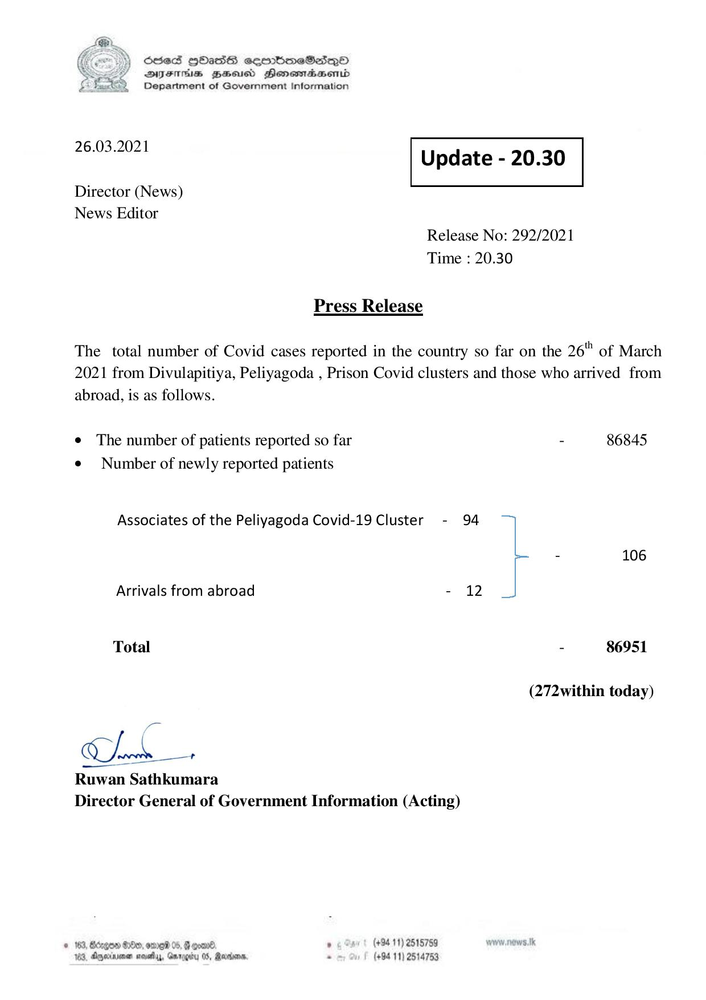

# Press Release - 2021.03.26 
Key: 3f29d1a4a73ded0517e03884b8801d28 

---
```
) ScdeS HOadS cermbmeSsdQo
DVEFIHS HHosd Honomabsenid
Department of Government Information

 

 

26.03.2021 Update - 20.30

 

 

 

Director (News)
News Editor

Release No: 292/2021
Time : 20.30

Press Release
The total number of Covid cases reported in the country so far on the 26" of March
2021 from Divulapitiya, Peliyagoda , Prison Covid clusters and those who arrived from

abroad, is as follows.

e The number of patients reported so far - 86845
¢ Number of newly reported patients

Associates of the Peliyagoda Covid-19 Cluster - 94

- 106
Arrivals from abroad - 12
Total - 86951
(272within today)

Clande —+

Ruwan Sathkumara
Director General of Government Information (Acting)

© 163, Bdego B80, omred 05, # ome ° (+94 11) 2515789 wer news. Tk
163, Ageia sosety, Gnrggiu 05, Radena. - (+94 11) 2514753

```
