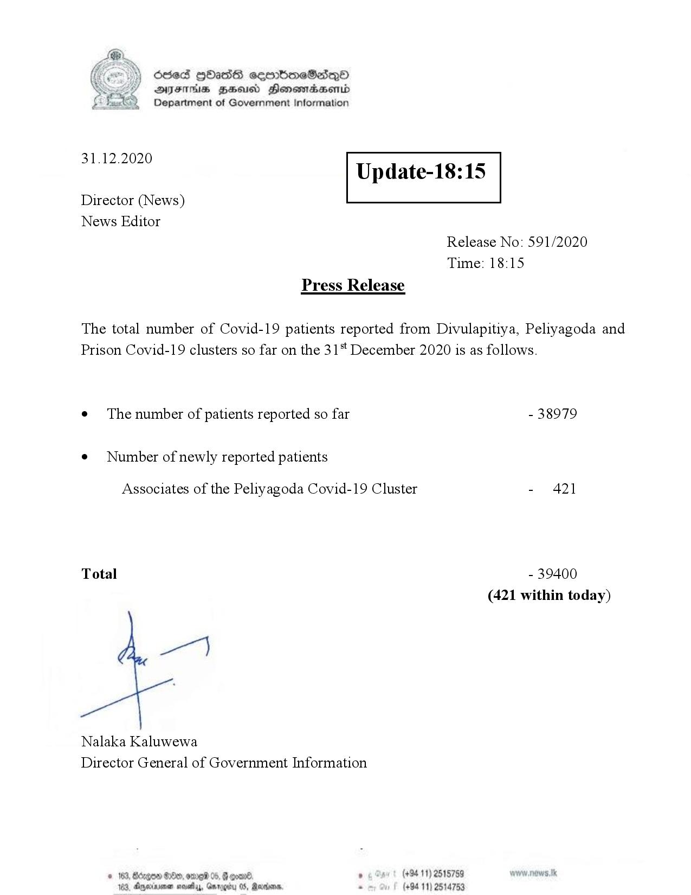

# Press Release - 2020.12.31 
Key: 4008f3dd6ec104a7c5a0a9ed1d0994bc 

---
```
Ssed HbasG sembmeSadqo
DAIS BHU Honomasentd
Department of Government Information

 

 

31.12.2020

Update-18:15

 

 

 

Director (News)
News Editor
Release No: 591/2020
Time: 18:15
Press Release

The total number of Covid-19 patients reported from Divulapitiya, Peliyagoda and
Prison Covid-19 clusters so far on the 31 December 2020 is as follows.

e¢ The number of patients reported so far - 38979

¢ Number of newly reported patients

Associates of the Peliyagoda Covid-19 Cluster - 421

Total - 39400

(421 within today)

Nalaka Kaluwewa
Director General of Government Information

© 163, Bcrgen 88, eng 05, @ erane ’ (+94 11) 2515759
183, Anexrnsne seve, Garogity 05, Ranana, - (+94 11) 2514753

```
