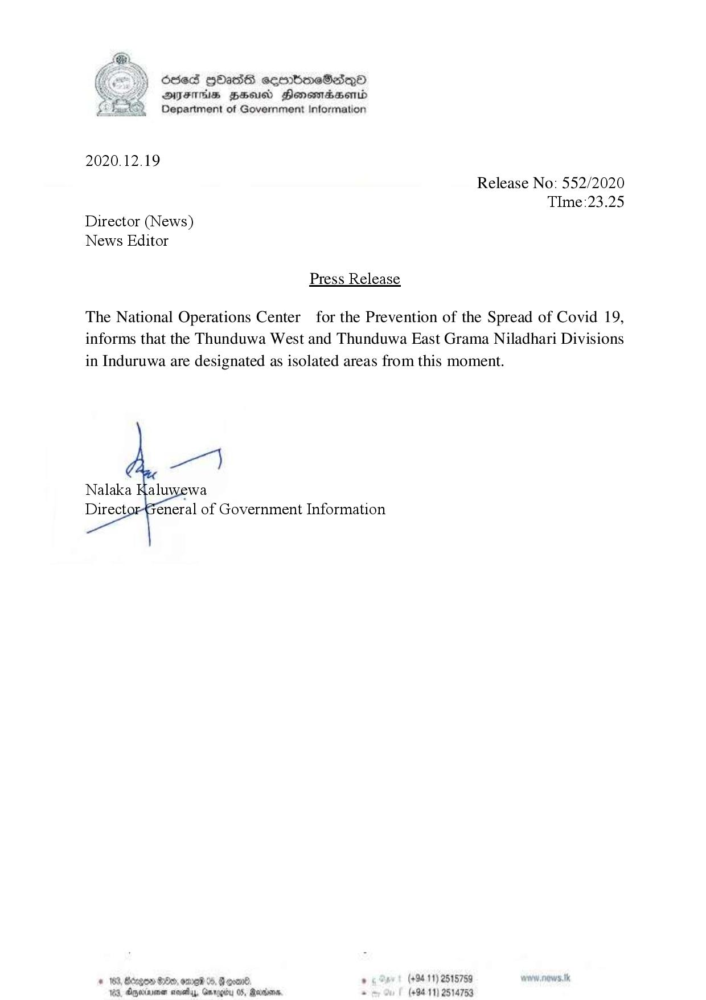

# Press Release - 2020.12.19 - Thunduwa West and Thunduwa East  Grama niladhari Divisions are isolated from this moment 
Key: 409c1be6891fb6c4e7f269c26ac32409 

---
```
6865 HHasG sembmcSsqQoO
Dsus Hess Honsmadsentd
Department of Government Information

 

2020.12.19

Release No: 552/2020
TIme:23.25
Director (News)
News Editor

Press Release

The National Operations Center for the Prevention of the Spread of Covid 19,
informs that the Thunduwa West and Thunduwa East Grama Niladhari Divisions
in Induruwa are designated as isolated areas from this moment.

 

# 163, Bcegen Se, ome 04. Foon. » 5 Smet (48411) 2515759 worn neve tk
Vea, Anecinronen sey, Greg 05, Maras. 2 (+9411) 2514753

```
