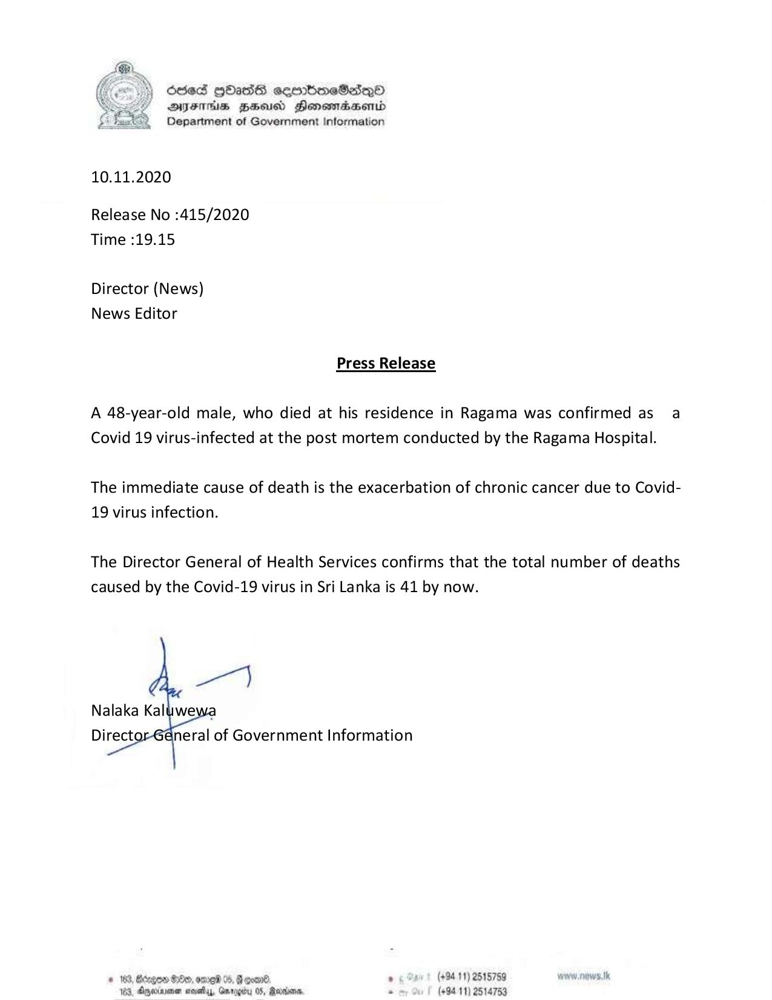

# Press Release - 2020.11.10 -  Covid 19 infection death rises to 41 
Key: 412c1f2d2927b963eaa7ae2ac426ee6c 

---
```
6865 HOass sermbaeSaqQo
SYsFTHs Hse Henema&aentd
Department of Government Information

 

10.11.2020

Release No :415/2020
Time :19.15

Director (News)
News Editor

Press Release

A 48-year-old male, who died at his residence in Ragama was confirmed as a
Covid 19 virus-infected at the post mortem conducted by the Ragama Hospital.

The immediate cause of death is the exacerbation of chronic cancer due to Covid-
19 virus infection.

The Director General of Health Services confirms that the total number of deaths
caused by the Covid-19 virus in Sri Lanka is 41 by now.

ge)

Nalaka Kaluwe

 

```
