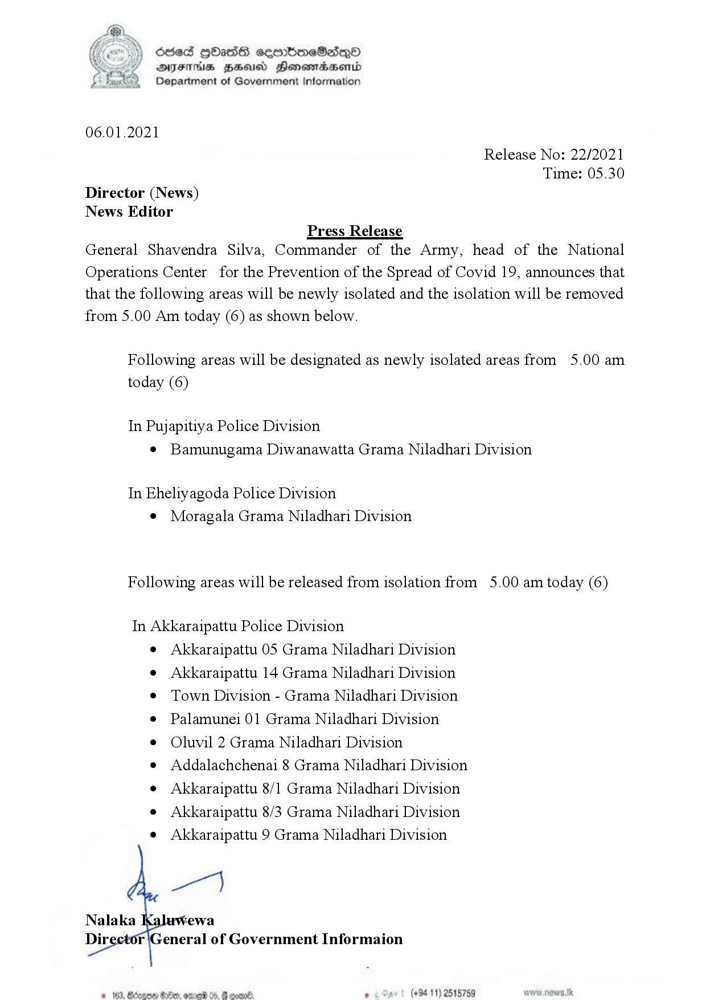

# Press Release - 2021.01.06- isolation lifting and newly isolated areas 
Key: 418d11e85c83d2c2da86c1710aa34875 

---
```
ff ) died GOATS ceenbneSedQ0
9 DQYIFTHS ZEUS HonswradsHenid
Department of Government Information

 

06.01.2021

Release No: 22/2021
Time: 05.30
Director (News)
News Editor
Press Release
General Shavendra Silva, Commander of the Army, head of the National

Operations Center for the Prevention of the Spread of Covid 19, announces that
that the following areas will be newly isolated and the isolation will be removed
from 5.00 Am today (6) as shown below.

Following areas will be designated as newly isolated areas from 5.00 am
today (6)

In Pujapitiya Police Division
e Bamunugama Diwanawatta Grama Niladhari Division

In Eheliyagoda Police Division
© Moragala Grama Niladhari Division

Following areas will be released from isolation from 5.00 am today (6)

In Akkaraipattu Police Division
e Akkaraipattu 05 Grama Niladhari Division
e Akkaraipattu 14 Grama Niladhari Division
¢ Town Division - Grama Niladhari Division
¢ Palamunei 01 Grama Niladhari Division
¢ Oluvil 2 Grama Niladhari Division
e Addalachchenai 8 Grama Niladhari Division
e Akkaraipattu 8/1 Grama Niladhari Division
e Akkaraipattu 8/3 Grama Niladhari Division
e Akkaraipattu 9 Grama Niladhari Division

  
  

Nalaka
Dir r |General of Government Informaion

° (+94 11) 2515759

 

e 163,

```
