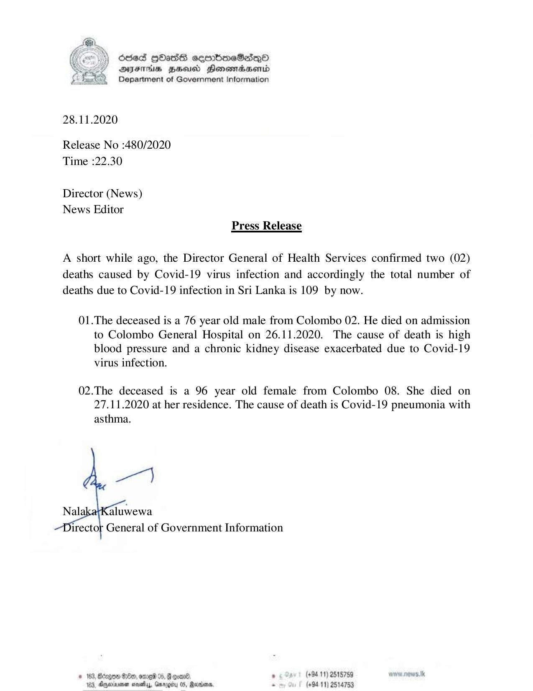

# Press Release - 2020.11.28 - Covid 19 infection death rises to 109 
Key: 42aa804e3d80786234dc90544ed2a32b 

---
```
6563 HOHasG sembmcSasqQo
DAJFITAs BHU Honomrdbsertd
Department of Government Information

 

28.11.2020

Release No :480/2020
Time :22.30

Director (News)
News Editor
Press Release

A short while ago, the Director General of Health Services confirmed two (02)
deaths caused by Covid-19 virus infection and accordingly the total number of
deaths due to Covid-19 infection in Sri Lanka is 109 by now.

01.The deceased is a 76 year old male from Colombo 02. He died on admission
to Colombo General Hospital on 26.11.2020. The cause of death is high
blood pressure and a chronic kidney disease exacerbated due to Covid-19
virus infection.

02.The deceased is a 96 year old female from Colombo 08. She died on
27.11.2020 at her residence. The cause of death is Covid-19 pneumonia with
asthma.

   

irector General of Government Information

* 163, Bcogon Ge, ome %, G goad . (+94 11) 2515759 ww. news. tk
123, Oneiarnen sovaby, Grrogity 05, Madan. . (+9411) 2514753

```
