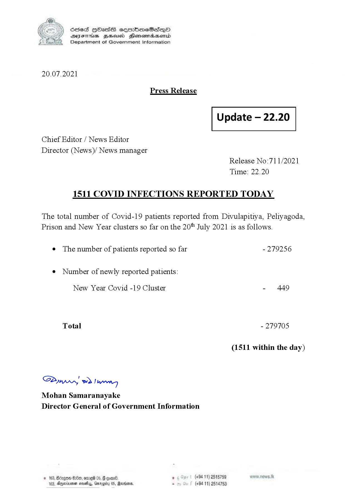

# Press Release - 2021.07.20 - Covid 19 inection report 
Key: 42b2aed8d037a9768b6dc6934f37252c 

---
```
(6 S) ScseS HOasdS cerrbmeSdQo
DFTs BHEosd Henewtaeasernid
Department of Government Information

 

20.07.2021

Press Release

 

Update — 22.20

 

 

 

Chief Editor / News Editor

Director (News)/ News manager
Release No:71 1/2021
Time: 22.20

1511 COVID INFECTIONS REPORTED TODAY

The total number of Covid-19 patients reported from Divulapitiya, Peliyagoda,
Prison and New Year clusters so far on the 20" July 2021 is as follows.

e The number of patients reported so far - 279256

¢ Number of newly reported patients:

New Year Covid -19 Cluster - 449

Total - 279705

(1511 within the day)

Saw 2) won,
Mohan Samaranayake
Director General of Government Information

© 163, Bdegon G80, ome 0 6 ’ (+94 11) 2515759
163, Agere naethy, Gmrogiby 05, Rereisons, - (+94 11) 2514753

 

```
