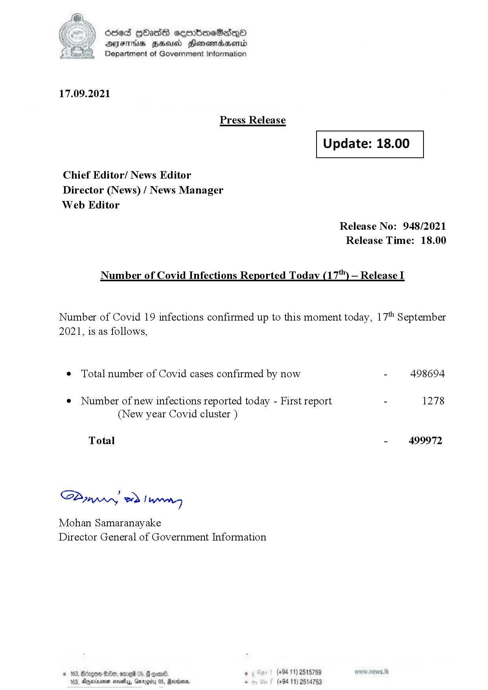

# Press Release - 2021.09.17 
Key: 435d88be165e5e33ad9ec98578dd34ab 

---
```
fe) Oded Hbas eeenbmeSedeqQO
DFS HHS Honsmadserid
Department of Government Information

 

17.09.2021

Press Release

 

Update: 18.00

 

 

 

Chief Editor/ News Editor
Director (News) / News Manager
Web Editor

Release No: 948/2021
Release Time: 18.00

Number of Covid Infections Reported Today (17) — Release I

Number of Covid 19 infections confirmed up to this moment today, 17" September
2021, is as follows,

¢ Total number of Covid cases confirmed by now - 498694

¢ Number of new infections reported today - First report - 1278
(New year Covid cluster )

Total - 499972

SPynprny wd! weg

Mohan Samaranayake
Director General of Government Information

® (+94 11) 2515759
(+94 11) 2514753

  

© 163, Bdrgon Ge, ome 04
103, Dexrmen novelas, Garogi

```
