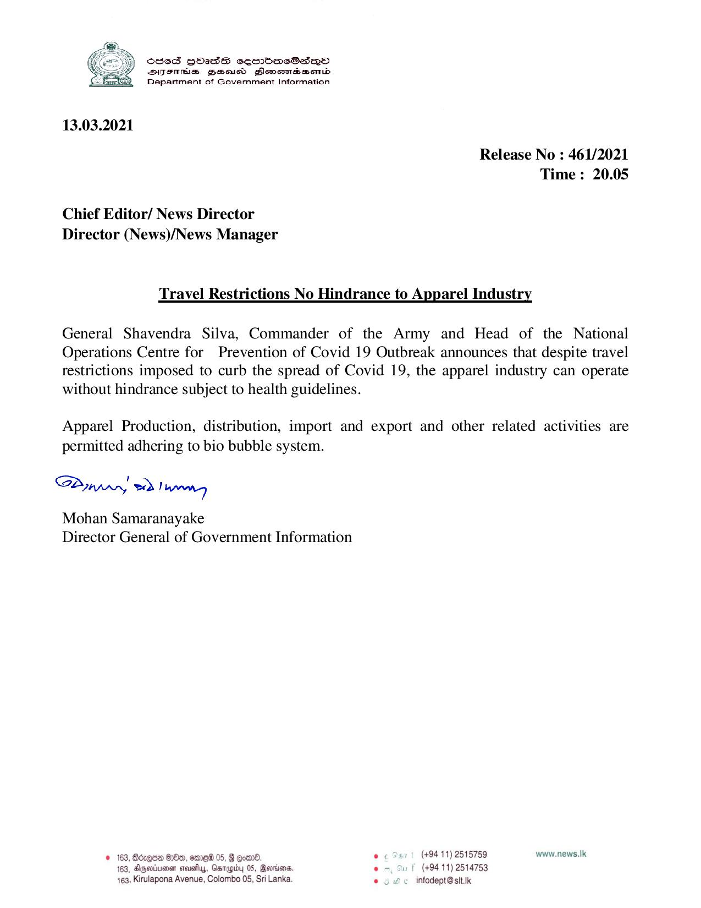

# Press Release - 2021.05.13 - Travel Restrictions No Hindrance to Apparel Industry 
Key: 4379501775e0d5e546e6266a21fcbec8 

---
```
S585 HOass oembasSano
SITSTHS Zeocd Slomomssond
Department of Government Information

 

13.03.2021

Release No : 461/2021
Time: 20.05

Chief Editor/ News Director
Director (News)/News Manager

Travel Restrictions No Hindrance to Apparel Industry

General Shavendra Silva, Commander of the Army and Head of the National
Operations Centre for Prevention of Covid 19 Outbreak announces that despite travel
restrictions imposed to curb the spread of Covid 19, the apparel industry can operate
without hindrance subject to health guidelines.

Apparel Production, distribution, import and export and other related activities are
permitted adhering to bio bubble system.

Sunny vad Tapmong

Mohan Samaranayake
Director General of Government Information

© 163, Bdzqon OOo, ome 05, § Eom . (+94 11) 2515759 www.news.Ik
163, Agmiuman cmushy, Garapy 05, Bertier em, Su F (+9411) 2514753
163, Kirulapona Avenue, Colombo 05, Sri Lanka © 2 Le infodept@sit.ik

```
