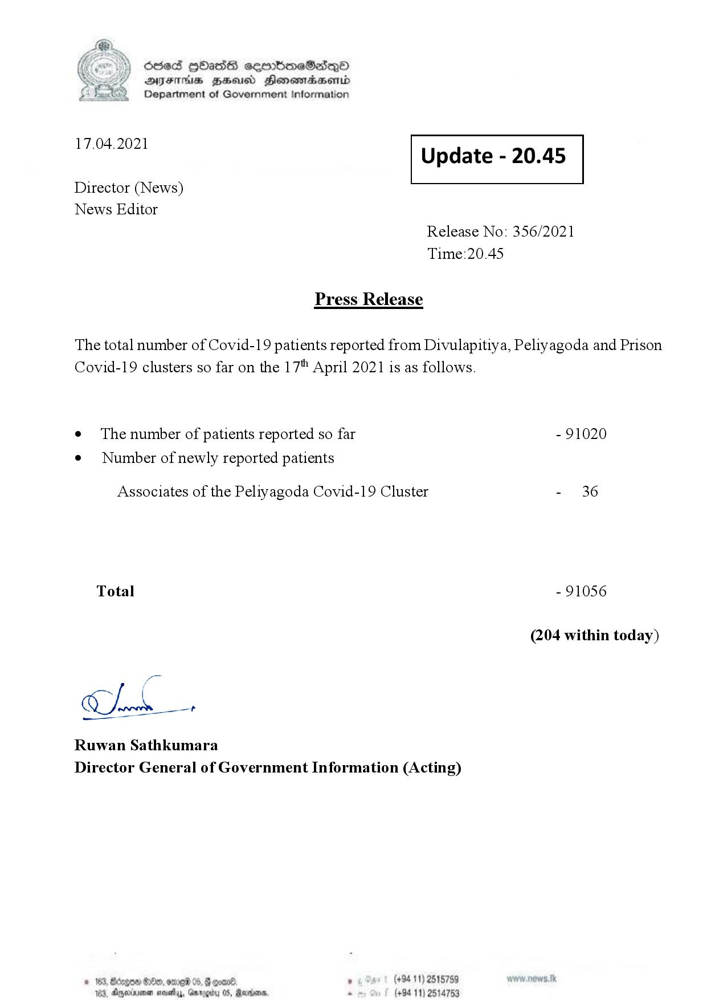

# Press Release - 2021.04.17 
Key: 4388d6a043fafe11a501ea79c6174eae 

---
```
\) O63 GOadS ceortimeSzdQO
AIFS BHU Henewmadasentd
Department of Government Information

 

 

17.04.2021 Update - 20.45

 

 

 

Director (News)

News Editor
Release No: 356/2021
Time:20.45

Press Release

The total number of Covid-19 patients reported from Divulapitiya, Peliyagoda and Prison
Covid-19 clusters so far on the 17" April 2021 is as follows.

e The number of patients reported so far - 91020

¢ Number of newly reported patients

Associates of the Peliyagoda Covid-19 Cluster - 36
Total - 91056
(204 within today)

gil

Ruwan Sathkumara

 

Director General of Government Information (Acting)

© 163, Bago Oe, ore 05, @ goane. ° (+94 11) 2515759
103, Anexuene saeiy, Grrogby 05, Rares. . (+94 11) 2514753

```
