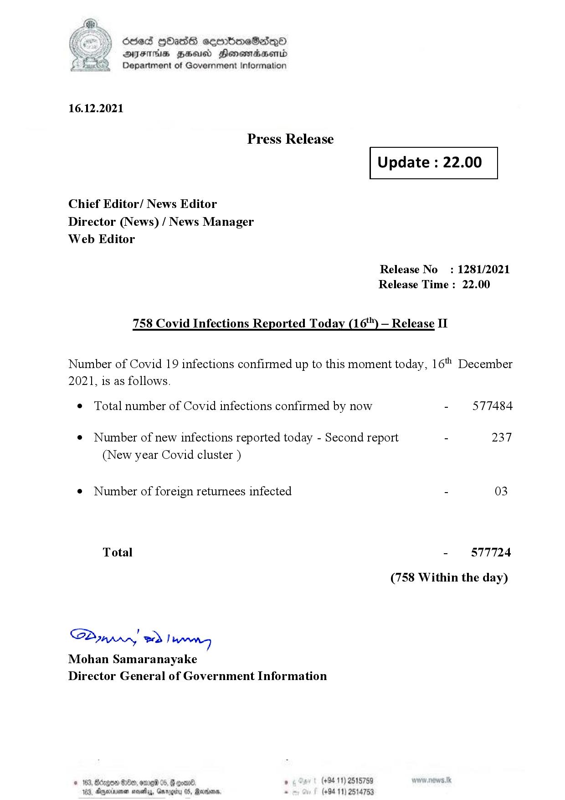

# Press Release - 2021.12.16 - Covid 19 Infection Report 
Key: 43bbda0e08420d4b1e94d08e786a25d7 

---
```
dosed GOass eemmbmeSadepO
DFS BHU Honswnradasentd
Department of Government Information

 

 

16.12.2021

Press Release

 

Update : 22.00

 

 

 

Chief Editor/ News Editor
Director (News) / News Manager
Web Editor

Release No: 1281/2021
Release Time : 22.00

758 Covid Infections Reported Today (16) — Release II

Number of Covid 19 infections confirmed up to this moment today, 16" December
2021, is as follows.

¢ Total number of Covid infections confirmed by now - 577484

¢ Number of new infections reported today - Second report - 237
(New year Covid cluster )

¢ Number of foreign returnees infected - 03
Total - 577724
(758 Within the day)

SP nprrn wd Ianwng
Mohan Samaranayake
Director General of Government Information

(+94 11) 2515759
(+94 11) 2514753

GOD 100, omg 05
Doyerinsonen snevetyy, Garo

   

```
