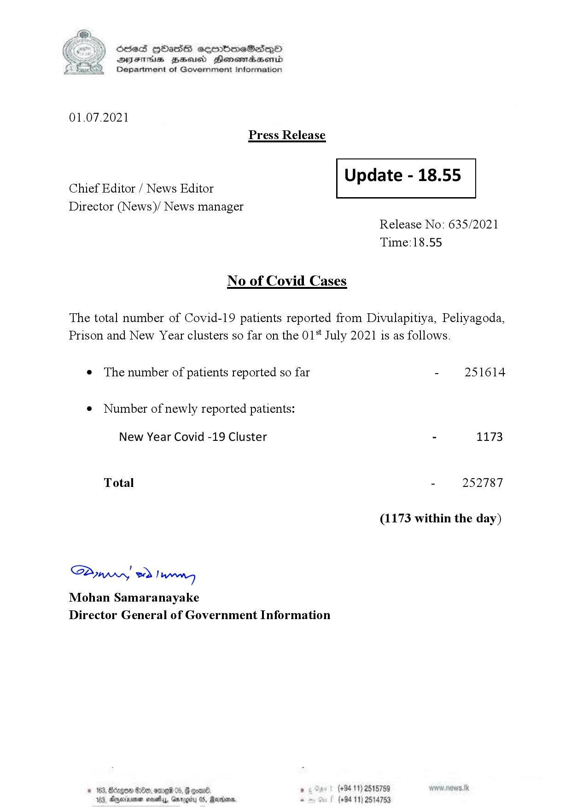

# Press Release - 2021.07.01 
Key: 43d92e213b9548ac3988205883c1f634 

---
```
S) ScseS HOasdS cerrbmeSdQo
DFTs BHEosd Henewtaeasernid
Department of Government Information

 

01.07.2021
Press Release

 

Update - 18.55

 

 

Chief Editor / News Editor
Director (News)/ News manager

 

Release No: 635/2021
Time:18.55

No of Covid Cases

The total number of Covid-19 patients reported from Divulapitiya, Peliyagoda,
Prison and New Year clusters so far on the 01 July 2021 is as follows.

e The number of patients reported so far - 251614
¢ Number of newly reported patients:

New Year Covid -19 Cluster - 1173

Total - 252787

(1173 within the day)

Saw 2) wn
Mohan Samaranayake
Director General of Government Information

$20, ome 06, 8 goav8. , (+94 11) 2515759
DAnarinoe sevety, Garogicy 05, Raden, - (+94 11) 2514753

 

```
